# ROADMAP — Mega Rental Garut

Rencana bertahap untuk mengubah prototype statis (`index.html` untuk pelanggan, `admin.html` untuk admin) menjadi aplikasi Laravel + Inertia + Vue 3 + MySQL yang dipakai harian di shared hosting/cPanel.

> **Dokumen ini adalah sumber kebenaran.** Setiap fase yang sudah selesai harus cocok dengan kode yang ada di `mega-rental/`. Kalau ada beda, kodinglah yang dianggap benar atau dokumen ini diperbarui — jangan dibiarkan keduanya berbeda diam-diam.

## Gambaran Umum

| Komponen | Pilihan |
|---|---|
| Framework | Laravel 13 (PHP 8.3) |
| Frontend | Inertia.js 3 + Vue 3, Vite, Tailwind CSS 4 |
| Database | MySQL 8 (utf8mb4) di hosting; SQLite untuk pengembangan lokal |
| Deployment | Shared hosting / cPanel, `public/` sebagai document root |
| Zona waktu | Asia/Jakarta |

Prinsip yang dipakai sejak awal dan berlaku di semua fase:

- **Satu sumber kebenaran untuk angka bisnis.** Tidak ada tarif, diskon, nomor WA, toleransi, atau denda yang ditulis mati di markup atau di komponen Vue. Semuanya dibaca dari `settings`, `pricing_tiers`, dan `group_discounts`.
- **Stok tidak pernah dihitung ulang di frontend.** Halaman publik hanya menampilkan angka yang sudah dihitung server (`BookingService::stockByType()`).
- **Tidak ada referensi aset hard-coded.** Semua aset lewat `@vite` + manifest, sehingga build di hosting tidak rusak saat nama file berubah (hash).
- **Uang selalu integer rupiah.** Tidak ada float dan tidak ada pembulatan di tampilan.
- **Prototype tetap utuh.** `index.html` dan `admin.html` tidak pernah diedit selama migrasi; keduanya hanya dirujuk sebagai rujukan desain.
- **Cache harus aman di shared hosting.** `config:cache`, `route:cache`, dan `view:cache` harus tetap berfungsi, dan tidak ada proses background (Node, queue worker) yang wajib hidup.

**Status saat ini:** Fase 0-10 selesai - prototype statis sudah ada, dan di `mega-rental/` sudah jalan Laravel + Inertia + Vue 3, database + data awal, login admin, modul armada (unit, status, filter, servis, arsip), modul tarif/diskon/pengaturan (semua angka bisnis pindah ke database dan bisa diedit admin), modul booking (lifecycle penuh, alokasi unit, denda, dan stok yang selalu akurat), halaman pelanggan (landing page database, kalkulator harga, pemesanan tanpa login, dan cek booking), aturan keterlambatan (auto-rilis stok, penandaan denda sebelum check-in, dan naskah notifikasi WhatsApp), QRIS Tahap 1 (tagihan otomatis per pesanan, verifikasi manual, antrean pembayaran, QR statis milik usaha, serta kartu pendapatan bulanan di dashboard), serta laporan & ekspor (rekap pendapatan harian dengan grafik, ekspor CSV, rekap pelanggan per nomor WhatsApp, template pesan, dan broadcast). Fase 11 (Hardening, Optimasi & Go-Live) sudah selesai di sisi kode: header keamanan + CSP, cache landing page yang membuang dirinya sendiri saat tarif atau stok berubah, perintah backup & uji restore berbasis PHP murni, dan `go-live:check`. Sisanya langkah operasional di server. Fase 12 mulai jalan: log servis berkala sudah jadi (tabel `service_logs`, enum `ServiceKind`, halaman `/admin/servis` dengan daftar unit yang jatuh tempo), testimoni pelanggan sudah jadi (tabel `testimonials`, halaman `/admin/testimoni`, section testimoni di beranda), dan dashboard mingguan sudah jadi (halaman `/admin/mingguan` dengan grafik 7 hari, perbandingan minggu lalu, dan ekspor cetak/PDF lewat dialog cetak peramban); integrasi eksternal juga sudah: WhatsApp Business API sebagai adapter yang bisa dinyalakan lewat `.env` (bawaannya tetap tidak mengirim, dan `wa:send-reminders` sudah terjadwal), peta lokasi yang ikut mengikuti alamat usaha, dan rangka QRIS dinamis. Sisa Fase 12 masih ditunda sampai setelah launch.

---

## Daftar Isi

1. [Peta Fase](#peta-fase)
2. [Fase 0 - Prototype](#fase-0--prototype-✅-selesai)
3. [Fase 1 - Fondasi Project](#fase-1--fondasi-project-✅-selesai)
4. [Fase 2 - Database & Domain](#fase-2--database--domain-✅-selesai)
5. [Fase 3 - Auth Admin](#fase-3--auth-admin-✅-selesai)
6. [Fase 4 - Modul Armada](#fase-4--modul-armada-✅-selesai)
7. [Fase 5 - Tarif, Diskon & Pengaturan](#fase-5--tarif-diskon--pengaturan-✅-selesai)
8. [Fase 6 - Modul Booking](#fase-6--modul-booking-✅-selesai)
9. [Fase 7 - Halaman Pelanggan ✅ selesai](#fase-7--halaman-pelanggan-✅-selesai)
10. [Fase 8 - Aturan Keterlambatan ✅ selesai](#fase-8--aturan-keterlambatan-✅-selesai)
11. [Fase 9 - QRIS ✅ selesai (Tahap 1)](#fase-9--qris-✅-selesai-tahap-1)
12. [Fase 10 - Laporan & Ekspor ✅ selesai](#fase-10--laporan--ekspor-✅-selesai)
13. [Fase 11 - Hardening, Optimasi & Go-Live 🚧 kode selesai](#fase-11--hardening-optimasi--go-live-🚧-kode-selesai)
14. [Fase 12 - Pasca Go-Live 🚧 berjalan](#fase-12--pasca-go-live-🚧-berjalan)
15. [Struktur Folder](#struktur-folder)
16. [Skema Database Ringkas](#skema-database-ringkas)
17. [Checklist Kepatuhan](#checklist-kepatuhan)
18. [Risiko & Mitigasi](#risiko--mitigasi)
19. [Estimasi Waktu](#estimasi-waktu)
20. [Lampiran - Pemetaan Prototype → Kode Produksi](#lampiran--pemetaan-prototype--kode-produksi)

---

## Peta Fase

```mermaid
flowchart LR
    F0["Fase 0<br/>Prototype<br/>✅ selesai"] --> F1["Fase 1<br/>Fondasi Project<br/>✅ selesai"]
    F1 --> F2["Fase 2<br/>Database &amp; Domain<br/>✅ selesai"]
    F2 --> F3["Fase 3<br/>Auth Admin<br/>✅ selesai"]
    F3 --> F4["Fase 4<br/>Modul Armada<br/>✅ selesai"]
    F4 --> F5["Fase 5<br/>Tarif, Diskon &amp; Pengaturan<br/>✅ selesai"]
    F5 --> F6["Fase 6<br/>Modul Booking<br/>✅ selesai"]
    F6 --> F7["Fase 7<br/>Halaman Pelanggan<br/>✅ selesai"]
    F7 --> F8["Fase 8<br/>Keterlambatan<br/>✅ selesai"]
    F8 --> F9["Fase 9<br/>QRIS<br/>✅ selesai"]
    F9 --> F10["Fase 10<br/>Laporan &amp; Ekspor<br/>✅ selesai"]
    F10 --> F11["Fase 11<br/>Hardening &amp; Go-Live<br/>🚧 kode selesai"]
    F11 --> F12["Fase 12<br/>Pasca Go-Live<br/>🚧 berjalan"]
```



| Fase | Modul | Output | Status / Estimasi |
|---|---|---|---|
| 0 | Prototype | `index.html`, `admin.html` | ✅ selesai |
| 1 | Fondasi Project | Laravel + Inertia + Vue 3 + Tailwind jalan di localhost | ✅ selesai |
| 2 | Database & Domain | Migrasi, seeder, model, enum, factory | ✅ selesai |
| 3 | Auth Admin | Login, layout, middleware, 1 akun admin | ✅ selesai |
| 4 | Modul Armada | Unit, status Ready/Disewa/Servis | ✅ selesai |
| 5 | Tarif, Diskon & Pengaturan | Tarif, tier diskon, aturan, profil usaha | ✅ selesai |
| 6 | Modul Booking | Booking lifecycle + reassignment unit | ✅ selesai |
| 7 | Halaman Pelanggan | Landing page dari prototype | ✅ selesai |
| 8 | Aturan Keterlambatan | Auto-rilis stok, denda, scheduler | ✅ selesai |
| 9 | QRIS | Tagihan per pesanan, verifikasi manual, antrean bayar, QR statis | ✅ selesai (Tahap 1) |
| 10 | Laporan & Ekspor | Rekap harian, pelanggan, CSV | ✅ selesai |
| 11 | Go-Live | Header keamanan, cache landing page, backup, `go-live:check` | 🚧 kode selesai (go-live menunggu) |
| 12 | Pasca Go-Live | Log servis (✅), testimoni (✅), dashboard mingguan + cetak (✅), WA API + peta (✅), rangka QRIS dinamis | 🚧 berjalan |

---

## Fase 0 — Prototype ✅ selesai

**Tujuan:** mengunci keputusan desain dan istilah sebelum menulis satu baris framework, supaya migrasi tidak berubah jadi sekadar menulis ulang.

### 0.1 Isi prototype
1. **`index.html` (pelanggan)** — hero, kartu stok real-time, daftar harga + badge BEST VALUE/REKOMENDASI, blok QRIS, blok aturan keterlambatan, kalkulator harga interaktif, keunggulan, lokasi & jam, footer.
2. **`admin.html` (admin)** — dashboard dengan kartu statistik, daftar armada (filter tipe/status/pencarian), stok & harga (tabel tarif + diskon group), rekap per pelanggan, laporan harian, halaman pengaturan, dan sistem toast.

### 0.2 Keputusan desain yang dikunci di sini
- Palet: `brandGreen` untuk aksi utama dan penanda berhasil, `brandOrange` untuk aksen harga/promo; teks gelap `slate` sebagai latar netral.
- Tipografi: Inter untuk teks, tabular numbers untuk kolom angka.
- Ikon: FontAwesome 6.4.0.
- Seluruh copy berbahasa Indonesia dan istilah domainnya dipakai apa adanya di aplikasi ("Rilis Stok", "Cek Booking", "Perlu Perhatian").

### 0.3 Batasan yang disengaja
- Prototype **tidak** diedit selama migrasi. Kalau ada yang perlu berubah, berubah di aplikasi; filenya tetap jadi bukti keputusan desain awal.
- Tidak ada backend di prototype. Semua interaksi (kalkulator, filter, simpan) hanya untuk memberi gambaran cara pakainya.

### 0.4 Exit criteria
- [x] `index.html` dan `admin.html` terbuka langsung di browser tanpa error.
- [x] Seluruh layar yang ada di prototype punya padanan di daftar halaman aplikasi di bawah.

---

## Fase 1 — Fondasi Project ✅ selesai

**Tujuan:** Laravel + Inertia + Vue 3 benar-benar jalan di localhost, dengan struktur yang siap diunggah ke hosting.

### 1.1 Paket & alat
| Paket | Versi | Catatan |
|---|---|---|
| `laravel/framework` | 13.x | PHP 8.3 |
| `inertiajs/inertia-laravel` | 3.x | SSR dimatikan |
| `tightenco/ziggy` | 2.6.x | membangkitkan `route()` untuk Vue; definisi rute dicetak `@routes` di `app.blade.php` |
| `vuejs` + `@vitejs/plugin-vue` | 3.x | satu root element per komponen |
| `tailwindcss` | 4.x | konfigurasi lewat CSS, tanpa `tailwind.config.js` |

Tidak ada Breeze/Jetstream - paket starter bawaannya membawa opinion siap pakai yang tidak dipakai di sini dan menambah file yang harus dibongkar.

Tidak ada paket npm `ziggy-js`: plugin Vue-nya di-import langsung dari `vendor/tightenco/ziggy/dist/index.esm.js`, jadi tidak ada dependensi npm tambahan.

### 1.2 Keputusan struktural
- **Root view Inertia = `app`.** `resources/views/app.blade.php` hanya menampilkan `@vite` dan `@inertia`; tidak ada Blade view per halaman.
- **`route()` di sisi klien wajib selalu tersedia.** Seluruh halaman Vue memanggil `route('nama.rute')`, jadi `@routes` (Ziggy) cetak definisi rute sebagai global sebelum `@vite`, dan `ZiggyVue` didaftarkan sebagai plugin Vue. Tanpa dua ini setiap komponen gagal saat render di peramban, sementara sisi server dan test tetap hijau.
- **SSR dimatikan** di `config/inertia.php`. Shared hosting tidak punya proses Node, dan HTML yang sudah dirender server cukup untuk halaman ini.
- **Tiga layout**: `PublicLayout`, `AdminLayout`, `GuestLayout`. Semua halaman wajib punya tepat satu root element.
- **Pintu masuk admin dari halaman pelanggan ada di navbar, bukan cuma footer.** Ikon `fa-user-shield` + teks "Admin" di kanan atas, sebelah "Cek Booking"; di bawah 640px teksnya disembunyikan jadi hanya ikon 40px dengan `aria-label` yang jelas. Alasannya praktis: pemilik sering cek pesanan dari HP di jalan, dan di footer harus scroll sampai bawah dulu. Jalur footer tetap dipertahankan sebagai cadangan.
- **Pintu admin ikut menyesuaikan keadaan session.** Kalau admin masih login, tombolnya berubah jadi "Dashboard" (`fa-gauge-high`) plus tombol **Keluar** (`fa-arrow-right-from-bracket`, POST ke `route('logout')` dengan pola yang sama seperti `AdminLayout`). Tanpa tombol Keluar, admin yang login lewat panel lalu membuka beranda akan terjebak: session-nya masih hidup tapi tidak ada jalan keluar dari sana selain balik ke dashboard dulu. Label di footer juga berubah jadi "Dashboard Admin". Ketiganya membaca shared prop `auth.user` yang sama, jadi tidak perlu prop tambahan per halaman.
- **Beranda tidak pernah mengarahkan siapa pun ke panel.** `GET /` selalu merender `Public/Home`, termasuk untuk admin yang sedang login. Kalau `/` pernah terlihat membuka panel, itu karena session login masih hidup dan peramban melanjutkan ke halaman terakhir - bukan pengalihan. `PublicHomePageTest` menjaga dua sisi ini: `auth.user` benar-benar terkirim untuk tamu (`null`) dan untuk admin (idnya), dan admin yang buka `/` tetap dapat `Public/Home`.
- **Menyembunyikan pintu admin tidak menambah keamanan, jadi tidak dianggapkan sebagai perbaikan.** `/admin/login` bisa ditebak dalam satu percobaan tanpa tautan apa pun. Yang melindungi sudah ada di `LoginRequest`: maksimal 5 percobaan dengan throttle key gabungan email + IP. Yang benar-benar perlu dijaga adalah passwordnya - seeder masih memakai `mega-rental-2026`, dan selama itu belum diganti, tidak ada yang di navbar ini akan menyelamatkan akun.
- **`HandleInertiaRequests`** membagi `flash`, user yang login, nama aplikasi, versi aset, dan nama zona waktu ke semua halaman.
- **Toast flash harus dipicu flash baru, bukan hanya saat komponen dirender.** `FlashToast` hidup di dalam layout, dan layout Inertia tidak di-remount saat pindah halaman, jadi `onMounted` hanya pernah jalan sekali untuk seluruh sesi — setiap aksi yang flash-nya datang lewat navigasi Inertia (batal, konfirmasi, simpan harga, arsipkan sepeda, hapus pesanan) mengubah data tanpa memberi tahu apa pun ke admin. Visibilitasnya sekarang di-`watch` dengan `{ immediate: true }`, jadi perilaku untuk muat halaman pertama tetap sama. `FlashToastTest` menjaga invarian ini di sumber.
- **Bootstrap aplikasi** memakai `withRouting(web: routes/web.php, commands: routes/console.php, health: '/up')` supaya ada endpoint health check yang bisa dipakai untuk monitoring hosting.

### 1.3 Kesiapan untuk shared hosting
- `.env.example` sudah memuat blok MySQL (host, port, database, user, password) sehingga hanya perlu disalin lalu diisi.
- `APP_TIMEZONE=Asia/Jakarta`. Tanggal/waktu harus konsisten antara PHP, database, dan tampilan.
- Tidak ada referensi `/build/...` manual di mana pun. Semua aset lewat `@vite`, jadi aman saat nama file berubah.
- `config:cache`, `route:cache`, dan `view:cache` wajib tetap bisa dijalankan.

### 1.4 Exit criteria
- [x] `npm run dev` dan `npm run build` sama-sama sukses.
- [x] `GET /up` balas 200 di localhost.
- [x] `php artisan config:cache` + `route:cache` + `view:cache` tidak merusak aplikasi.
- [x] Ketiga layout sudah ter-render minimal satu halaman uji.

---

## Fase 2 — Database & Domain ✅ selesai

**Tujuan:** seluruh bentuk data & aturan bisnis dasar pindah dari hard-code ke database.

Migrasi (semua sudah dibuat): `create_users_table`, `create_cache_table`, `create_jobs_table`, `create_bikes_table`, `create_pricing_tiers_table`, `create_group_discounts_table`, `create_bookings_table`, `create_booking_items_table`, `create_payments_table`, `create_settings_table`, `create_wa_messages_table`, `create_activity_logs_table`, `add_role_to_users_table`, `add_label_to_pricing_tiers_table`.

### 2.1 Tabel inti
- `bikes` — kode unik (`S-01`, `T-01`), tipe, status, catatan kondisi, `archived_at`.
- `pricing_tiers` — tarif per (tipe, durasi), unik per pasangan; harga `BIGINT` rupiah penuh; `label` untuk badge Best Value/Rekomendasi.
- `group_discounts` — diskon bertingkat per (tipe, durasi, min_qty..max_qty); `max_qty` null berarti tier terbuka.
- `bookings` — jadwal (`date`, `start_time`, `duration_hours`, `quantity`), stempel waktu (`confirmed_at`, `checked_out_at`, `checked_in_at`, `cancelled_at`), dan kolom keterlambatan (`late_minutes`, `is_overdue`, `fine_amount`).
- `booking_items` — rincian unit per pesanan. Barisnya dibuat saat pesanan dibuat (`bike_id` null, harga dikunci di `price_per_unit`) dan dibangun ulang saat check-out ketika unit sebenarnya ditunjuk.
- `settings` — key-value; primary key string, di-cache `rememberForever`, dengan daftar default di `Setting::defaults()`.
- `activity_logs` — jejak audit aksi admin (siapa, apa, kapan, detail).

### 2.2 Enum, bukan string bebas
`BikeType` (single, tandem), `BikeStatus` (ready, rented, maintenance, archived), `BookingStatus` (pending, confirmed, rented, completed, cancelled, expired, no_show), `PaymentMethod` (qris, cod), `PaymentStatus`, `UserRole` (admin, staff), dan `ServiceKind` (rutin, perbaikan, ditambahkan di Fase 12). Tiap enum punya `label()` dan `tone()` supaya teks Indonesia dan warna badge tidak diulang di tiap halaman.

Kolom status di database tetap `string`, dik Casting ke enum di model. Alasannya: menambah status baru tidak butuh migrasi kolom, dan nilai yang tidak dikenal akan gagal cepat daripada lolos diam-diam.

### 2.3 Aturan yang mengikat sejak awal
- **Harga `BIGINT`, bukan `DECIMAL`/`FLOAT`.** Semua uang dihitung dalam rupiah penuh sebagai integer; konversi ke format tampilan hanya terjadi di `formatRupiah()`.
- **Stok tidak pernah dihitung dengan `COUNT` di halaman.** Satu-satunya sumber ketersediaan adalah `BookingService::stockByType()` / `availableQuantity()`.
- Booking `pending` yang lewat toleransi (lihat [Fase 8](#fase-8--aturan-keterlambatan)) otomatis jadi `expired` dan tidak pernah menyentuh stok.
- Model punya accessor untuk hal yang dipakai berulang (deadline, label status, kode unit) supaya perhitungan yang sama tidak ditulis ulang di controller, di service, dan di Vue.

### 2.4 Data awal & pengujian
- Seeder: `DatabaseSeeder` memanggil `AdminUserSeeder`, `BikeSeeder` (19 unit single + 2 unit tandem, sama seperti prototype), `PricingSeeder`, `GroupDiscountSeeder`, dan `SettingSeeder`.
- Factory tersedia untuk `User`, `Bike`, `PricingTier`, `GroupDiscount`, `Booking`, `BookingItem`, dan `Payment` dengan state yang bisa dipilih (`single()`, `ready()`, `rented()`), supaya test tidak pernah membuat model secara manual.
- `.env.example` memuat blok MySQL agar hanya perlu disalin saat pindah hosting (uji MySQL dijadwalkan di [Fase 11](#fase-11--hardening-optimasi--go-live-🚧-kode-selesai)).

### 2.5 Exit criteria
- [x] `migrate:fresh --seed` jalan bersih dari nol.
- [x] Semua angka yang dulu hard-code di prototype sekarang terbaca dari tabel.
- [x] Tidak ada kolom uang bertipe pecahan.
- [x] Test konsistensi stok hijau.

---

## Fase 3 — Auth Admin ✅ selesai

**Tujuan:** satu pintu masuk untuk panel admin, cukup untuk operasional harian tanpa perlu sistem role yang lengkap.

### 3.1 Pendekatan
Auth ditulis manual (`Auth\LoginController` + `Auth\Login.vue`) tanpa Breeze. Yang dipakai: session-based login, satu middleware `auth`, logout via POST, dan rate limit percobaan login. `users.role` sudah tersedia, tetapi otorisasi per role adalah [Fase 12](#fase-12--pasca-go-live-🚧-berjalan).

### 3.2 Antipattern yang dihindari
- **Nama route polos, bukan `auth.*`.** Route admin dipanggil `admin.bookings.index`, `admin.dashboard`, `login`, `logout`; tidak ada prefiks yang tidak perlu.
- **GET hanya untuk membaca.** Semua aksi yang mengubah status atau menyimpan formulir menggunakan POST.
- **Tidak ada halaman registrasi.** Akun dibuat lewat seeder; tidak ada endpoint yang menambah user dari panel.
- **Password tidak pernah ditampilkan lagi** setelah disimpan, dan `password` selalu di-hash.

### 3.3 Catatan
Akun admin awal dari seeder (`admin@megarental.test` dengan password default) **wajib diganti sebelum go-live**. Daftar lengkap termasuk di [Checklist Kepatuhan](#checklist-kepatuhan).

### 3.4 Exit criteria
- [x] `/admin` tanpa login → redirect ke form login.
- [x] Login gagal → flash error, tidak ada informasi yang membocorkan (email terdaftar atau bukan).
- [x] Logout menghapus session dan tidak bisa diklik ulang.
- [x] Layout admin (sidebar, header, flash) dipakai semua halaman `admin.*`.

---

## Fase 4 — Modul Armada ✅ selesai

**Tujuan:** semua unit properti bisa didata, dicari, dan Statusnya diubah dengan aman.

Route: `GET /admin/armada` (`admin.bikes.index`), `POST /admin/armada` (`admin.bikes.store`), `POST /admin/armada/{bike}/servis` (`admin.bikes.maintenance`), `POST /admin/armada/{bike}/servis-selesai` (`admin.bikes.service-done`), `POST /admin/armada/{bike}/arsip` (`admin.bikes.archive`), `POST /admin/armada/{bike}/pulihkan` (`admin.bikes.restore`), `DELETE /admin/armada/{bike}` (`admin.bikes.destroy`).

### 4.1 Aturan main
- Kode unit dibuat otomatis per tipe (`S-01`, `T-02`, `T-01`, …) dan unik di database.
- **Status `rented` tidak bisa diubah dari UI.** Hanya `BookingService` yang boleh mengaturnya, lewat check-out dan check-in. Kalau UI bisa menyentuh status ini, Invarian stok bisa rusak tanpa jejak.
- **Arsip bukan hapus.** `archived_at` diisi, unit hilang dari daftar aktif, tetapi seluruh riwayatnya (booking, item, laporan) tetap utuh dan bisa ditelusuri. Hapus fisik (`destroy`) hanya untuk unit yang belum pernah dipakai.
- Ketersediaan selalu lewat `Bike::query()->available()`, dipakai bersama oleh dashboard, form booking, dan halaman pelanggan.

### 4.2 Halaman
- Filter tipe (Semua / Single / Tandem), filter status, dan pencarian kode.
- Kartu ringkas: total unit, siap disewa, sedang disewa, servis.
- Form tambah unit dengan catatan kondisi opsional.
- Aksi per baris: tandai servis, tandai servis selesai, arsip, pulihkan, hapus.

### 4.3 Catatan
Kartu-kartu ini memakai angka yang sama dengan form booking, jadi tidak ada lagi. untuk "19 Unit Ready" yang bisa berbeda dari kenyataan di database.

### 4.4 Exit criteria
- [x] Tambah, servis, arsip, pulihkan, hapus semua punya test.
- [x] Unit `rented` tidak punya tombol status manual.
- [x] Arsip tidak menghapus data historis.
- [x] Filter dan pencarian bekerja kombinasi.

---

## Fase 5 — Tarif, Diskon & Pengaturan ✅ selesai

**Tujuan:** semua angka bisnis — tarif, diskon, toleransi, denda, nomor WA, profil usaha — pindah ke database dan bisa diedit admin tanpa menyentuh kode.

Route: `GET /admin/pricing` (`admin.pricing.index`), `POST /admin/pricing` (`admin.pricing.update`), `GET /admin/pengaturan` (`admin.settings.index`), `POST /admin/pengaturan` (`admin.settings.update`), `POST /admin/pengaturan/reset-demo` (`admin.settings.reset-demo`).

### 5.1 Dua tabel, satu service
- `pricing_tiers` untuk tarif per durasi, `group_discounts` untuk diskon bertingkat.
- `PricingService` jadi satu-satunya tempat menghitung harga: tarif per durasi + diskon group yang cocok dengan (tipe, durasi, jumlah). Form admin hanya menyimpan angka; tidak ada perhitungan harga di komponen Vue.
- `pricing_tiers.label` ditambahkan supaya badge "Best Value" / "Rekomendasi" berasal dari database, bukan string di komponen Vue.

### 5.2 Pengaturan dikelompokkan
Halaman Pengaturan dibagi tiga grup: **profil** (nama usaha, tagline, alamat, jam buka, nomor WhatsApp), **qris** (NMID, nama merchant), dan **aturan** (`pickup_tolerance_minutes`, `late_return_fine`). Nilai yang tidak dikirim balik akan kembali ke default, jadi form tidak bisa menyimpan data kosong tanpa sengaja.

`settings` disimpan sebagai key-value dengan primary key string, di-cache dengan `rememberForever`, dan dihapus dari cache setiap kali ada penyimpanan.

### 5.3 Catatan
- Aturan keterlambatan: toleransi ambil (menit), denda telat kembali (Rp) — nilai ini dipakai [Fase 8](#fase-8--aturan-keterlambatan).
- `PricingService` sengaja tidak memakai cache: tarif dan diskon aktif dipengaruhi `is_active` dan bisa berubah kapan saja, sementara jumlah barisnya kecil; cache di sini hanya menambah sumber data basi.
- Validasi durasi minimum tidak berdiri sendiri — durasi dianggap sah kalau ada tarifnya. Konsisten dengan kalkulator yang selalu memetakan ke tier terdekat; aturan durasi sebagai aturan tersendiri belum masuk; menyatukan aturan tampilan baru relevan di [Fase 10](#fase-10--laporan--ekspor), waktu laporan harus seragam dengan angka di dashboard.
- Ada tombol reset ke data demo supaya demo di depan pelanggan bisa diulang tanpa menghapus data asli.

### 5.4 Exit criteria
- [x] Mengubah tarif langsung mengubah angka kalkulator di halaman pelanggan.
- [x] Mengubah diskon group langsung mengubah harga untuk jumlah yang sesuai.
- [x] Mengubah aturan keterlambatan langsung mengubah naskah notifikasi di [Fase 8](#fase-8--aturan-keterlambatan).
- [x] Reset demo mengembalikan angka awal tanpa merusak data lain.

---
## Fase 6 — Modul Booking ✅ selesai

**Tujuan:** inti sistem — seluruh lifecycle pesanan dengan stok yang selalu akurat.

Route: `GET /admin/bookings` (`admin.bookings.index`), `GET /admin/bookings/create` (`admin.bookings.create`), `POST /admin/bookings` (`admin.bookings.store`), `GET /admin/bookings/{booking}` (`admin.bookings.show`), `POST /admin/bookings/{booking}/konfirmasi` (`admin.bookings.confirm`), `POST /admin/bookings/{booking}/check-out` (`admin.bookings.check-out`), `POST /admin/bookings/{booking}/check-in` (`admin.bookings.check-in`), `POST /admin/bookings/{booking}/batal` (`admin.bookings.cancel`), `POST /admin/bookings/{booking}/rilis` (`admin.bookings.release`), dan `DELETE /admin/bookings/{booking}` (`admin.bookings.destroy`).

### 6.1 Alur status (state machine)
- Semua perpindahan hanya lewat `app/Services/BookingService.php`, bukan controller, supaya invarian yang sama berlaku juga dari seeder, command, atau konsol.
- `pending ──konfirmasi──► confirmed ──check-out──► rented ──check-in──► completed`; `pending`/`confirmed ──batal──► cancelled`; `confirmed ──rilis (telat ambil)──► cancelled`; `pending ──kedaluwarsa──► expired`.
- Tidak ada endpoint `set-status` generik. Tiap transisi punya route sendiri, dan `rented` **tidak punya** route manual — hanya check-out yang boleh memicunya (menjaga invarian Fase 4.3).
- Aksi yang statusnya salah ditolak `RuntimeException` berbahasa Indonesia lalu dikembalikan sebagai flash error, bukan 500.

### 6.2 Halaman `/admin/bookings` — `Pages/Admin/Bookings.vue`
- Tabel: kode, pelanggan, jadwal, armada, total, metode bayar, status, aksi. Pencarian (nama / kode / no. WA lewat `?q=`) dan filter status (`?status=`) memakai query string supaya tautannya bisa dibagikan.
- Filter cepat "Perlu Perhatian" (`?status=attention`) = `pending`, telat ambil, atau telat kembali. Karena bergantung waktu server, baris dihitung dulu lalu disaring di PHP — bukan kolom yang bisa basi.
- Badge keterlambatan dihitung real-time dari waktu server (`Booking::latePickupMinutes()`, `Booking::isLateReturn()`): `Telat ambil XX mnt` (amber) dan `Telat kembali` (merah). Sejak Fase 8 badge kembali membedakan denda yang **sudah tercatat** (denda tetap, tampil di merah tua) dari **perkiraan** yang baru akan dibebankan saat check-in.
- Aksi cepat per baris: lihat detail, chat WA, konfirmasi, **Mulai Sewa** (check-out), **Selesaikan** (check-in, membuka modal tagihan), batal, **Rilis Stok** (hanya muncul saat telat ambil), dan **Hapus** (ikon tong sampah, selalu di ujung kanan).
- Semua tombol dan izin aksinya (`can_confirm`, `can_check_out`, `can_check_in`, `can_cancel`, `can_release`, `can_delete`) dihitung di server dan dikirim sebagai prop.

### 6.2b Hapus permanen (`admin.bookings.destroy`)

"Batal" melepas stok tapi **menyisakan riwayat untuk audit**.	Hapus permanen untuk kasus lain: pesanan uji, pesanan duplikat, atau pesanan yang masuk tidak sengaja. Keduanya berdampingan, bukan saling menggantikan.

- Aturan & efeknya di `BookingService::delete()`, bukan controller, supaya aturan yang sama berlaku dari mana pun.
- Yang ikut terhapus mengikuti foreign key di migrasi: `booking_items` dan **`payments` cascade**, `wa_messages` dan `testimonials` nullOnDelete. Testimoni sengaja bertahan (tanpa tautan pesanan) supaya social proof di beranda tidak ikut hilang.
- **Status `rented` ditolak.** Unit fisiknya sedang dipegang pelanggan dan masih `rented` di tabel `bikes`; menghapus pesanan akan membuat unit itu menggantung tanpa baris yang melepasnya. Pesanan itu harus lewat check-in dulu. Aturan ini yang membuat `can_delete` false di dua halaman.
- Halaman detail/postsing redirect ke **daftar pesanan**, bukan `back()`: pesanan dihapus dari `/admin/bookings/{id}` juga, dan `back()` dari sana akan mengarah ke URL yang sudah tidak ada.
- Modal konfirmasi menyebutkan dampaknya dengan jujur, termasuk peringatan merah kalau pembayarannya sudah lunas atau belum diverifikasi — kasir harus tahu data yang hilang menyangkut uang.
- Jejak tetap ada: `ActivityLog` ditulis dengan `action = booking.deleted`. `subject_id` tetap diisi id aslinya karena `activity_logs.subject_id` polymorphic dan tidak punya FK ke `bookings`; detail pesanan disimpan di `meta` (kode, status, nama, tanggal, total, jumlah pembayaran yang terhapus) supaya pertanyaan "kenapa pesanan ini tidak ada?" masih bisa dijawab.

### 6.3 Detail pesanan (`/admin/bookings/{id}`) — `Pages/Admin/BookingDetail.vue`
- Ringkasan pelanggan, jadwal, armada, harga/unit, total, metode, dan nota catatan admin; badge status + badge keterlambatan; daftar unit yang dialokasikan.
- Timeline status dibangun dari kolom `*_at` (`confirmed_at`, `checked_out_at`, `checked_in_at`, `cancelled_at`, dan `expired_at` yang ditambahkan Fase 8).
- Modal **Selesaikan Sewa (check-in)**: menampilkan tagihan sewa, denda (jika ada), dan total diterima. Tombol "Konfirmasi Pengembalian" mengembalikan unit ke `ready`, mengubah status ke `completed`, dan menyimpan `is_overdue` / `late_minutes` / `fine_amount`.

### 6.4 Assign unit (reassignment)
- Saat **check-out**, `StockService::rentUnits()` memilih N unit `ready` sesuai tipe **urut kode**, mengunci barisnya (`lockForUpdate()`; no-op di SQLite), lalu menandai `rented` — semuanya dalam satu transaksi. Kalau unit `ready` kurang, seluruh transaksi dibatalkan dan pesanan tetap `confirmed`.
- `booking_items.bike_id` mencatat unit yang dipakai; detail menampilkan chip "Unit dialokasikan: S-01, S-02, …".
- Karena unit dipilih ulang saat check-out, unit yang mendadak masuk servis otomatis dilewati selama sisanya cukup.

### 6.5 Form Booking Manual (`/admin/bookings/create`) — `Pages/Admin/BookingForm.vue`
- Field: nama, WA, tanggal, jam, tipe, durasi, qty, metode bayar, catatan.
- Estimasi total dihitung di Vue dari prop `bookingOptions` (tarif + diskon per tipe & durasi yang dikirim server) — ini **tampilan saja**; total final dihitung ulang `PricingService::quote()` saat disimpan.
- Booking manual langsung berstatus `confirmed` (sudah di tangan admin) dan ikut menahan stok secara logis sampai check-out.

### 6.6 Pembatasan penting
- Validasi server (`StoreManualBookingRequest`): nama & WA wajib, tipe & metode bayar harus enum, durasi harus punya tarif aktif, qty tidak boleh melebihi stok tersedia, dan jadwal tidak boleh lebih dari 5 menit ke belakang (walk-in tetap bisa).
- Stok dicek dua kali: sekali di validasi (pesan per-field) dan sekali lagi di dalam transaksi service (anti-balapan), sehingga dua admin tidak bisa mengonfirmasi unit yang sama.
- Total, harga/unit, dan `booking_items` selalu dihitung server; angka dari browser tidak pernah dipercaya. Setiap aksi menulis `activity_logs` (`booking.created`, `booking.confirmed`, `booking.checked_out`, `booking.checked_in`, `booking.cancelled`, `booking.released`).
- Deteksi telat memakai jam server (`config('app.timezone')` dari `APP_TIMEZONE`); toleransi & denda dibaca dari `settings` (`pickup_tolerance_minutes`, `late_return_fine`), bukan konstanta di kode.

### 6.7 Exit criteria (terpenuhi)
- [x] Siklus penuh `pending → confirmed → rented → completed` berjalan dari UI dan diuji ulang lewat HTTP sungguhan di server lokal.
- [x] Stok `bikes` selalu konsisten dengan pesanan: `BookingServiceTest` menguji tiap langkah, termasuk pembatalan, kedaluwarsa, penolakan overbooking, dan check-out saat unit fisik kurang.
- [x] Denda dihitung server dari `settings` dan dicatat di header pesanan (`is_overdue`, `late_minutes`, `fine_amount`); rekapnya di laporan menunggu Fase 10.
- [x] Booking manual tersimpan dengan harga server yang benar, termasuk diskon rombongan.
- [x] Halaman & semua aksi tidak bisa diakses tanpa login.
- [x] `php artisan test` lulus seluruhnya (192 test / 1195 assertion), `vendor/bin/pint` bersih, `npm run build` sukses.

### 6.8 Catatan & penyimpangan dari rancangan
1. **Alokasi unit terjadi saat check-out, bukan saat konfirmasi.** Rancangan 2.3 menulis konfirmasi langsung `UPDATE bikes SET status='rented'`, sementara 4.3 dan 6.4 menulis `rented` hanya lahir dari check-out. Supaya invarian Fase 4.3 tetap utuh, konfirmasi hanya **menahan stok secara logis** (`BookingService::availableQuantity()` = unit `ready` dikurangi qty pesanan `confirmed` yang belum check-out), dan unit fisik baru berpindah saat check-out. `BookingStatus::reservesStock()` tetap bermakna: `confirmed` dan `rented` sama-sama dihitung sebagai stok terpakai.
2. **`booking_items` dibuat sejak pesanan dibuat** (satu baris per unit, `bike_id` null, `price_per_unit` dari quote server), bukan saat konfirmasi. Tujuannya harga satuan yang disepakati terkunci sejak awal; `bike_id` baru diisi saat check-out. Harga tetap dihitung ulang server, jadi ini bukan pelonggaran aturan "jangan percaya browser".
3. **"Rilis stok" jadi route sendiri (`bookings.release`), bukan sekadar "batal".** Rancangan menyebut "batal" untuk `pending`/`confirmed` dan tombol "Rilis Stok" terpisah di prototype. Route rilis menolak kalau pelanggan belum melewati toleransi, sehingga tombolnya tidak bisa dipakai untuk membatalkan pesanan yang masih wajar, dan catatan log membedakan alasan pembatalannya.
4. **Timezone aplikasi dibaca dari `APP_TIMEZONE`.** `config/app.php` sebelumnya hard-code `'UTC'` sementara `.env` sudah lama berisi `APP_TIMEZONE=Asia/Jakarta`. Badge "Telat ambil" dan batas denda bergantung pada jam server, jadi zona waktu yang benar bukan opsional. Perubahan ini satu baris dan tidak memecahkan test lama.
- Kartu ""Perlu Perhatian"" di dashboard **sudah terisi** sejak Fase 8: angkanya diambil dari `LatenessService::attention()` dan tautan menu menuju filter `?status=attention`. Kartu ""Pesanan Hari Ini"" juga diisi, dengan hint berapa pesanan aktif yang butuh perhatian.
6. **Modal check-in dipakai bersama** (`Components/BookingCheckInDialog.vue`) oleh halaman daftar & detail, supaya ringkasan tagihan/denda tidak ditulis dua kali.
7. **`formatTanggalID`, `formatDateTimeID`, `formatDuration` ditambahkan di `resources/js/Utils/format.js`** supaya label tanggal berbahasa Indonesia tidak bergantung pada locale PHP di shared hosting.
8. **Helper `whatsappLinkTo()` ditambahkan di `app/Support/helpers.php`** untuk tautan ke nomor **pelanggan** (tombol "Chat WA"), berbeda dari `whatsappLink()` yang selalu menuju nomor usaha.
9. **Uji overbooking sengaja dilakukan di dua lapis:** `StoreManualBookingRequest` menolak qty > stok tersedia dengan error kolom `quantity`, dan `BookingService` melempar `RuntimeException` di dalam transaksi. Test service memverifikasi transaksi di-rollback sehingga status pesanan tidak berubah saat stok kurang.

---

## Fase 7 — Halaman Pelanggan ✅ selesai

**Tujuan:** memindahkan `index.html` menjadi halaman Inertia `Public/Home.vue` yang datanya dibaca dari database.

Route: `GET /` (`home`), `POST /booking` (`booking.store`), `GET /booking/tersimpan` (`booking.saved`), `GET /cek-booking` (`booking.check`), `POST /cek-booking` (`booking.lookup`), `POST /booking/batal` (`booking.cancel`). Semuanya terbuka untuk tamu - tidak ada middleware auth. `booking.cancel` sengaja memakai POST dengan kode+nomor di body, bukan DELETE dengan kode di URL, supaya nomor telepon pelanggan tidak masuk log server maupun riwayat peramban.

### 7.1 Bagian halaman (meng mengikuti prototype)
1. **Hero** + CTA (Hitung & Sewa Sekarang, Lihat Daftar Harga).
2. **Kartu stok real-time** — angka "19 Unit Ready" & "2 Unit Tandem" diambil dari `bikes` (bukan hard-code). Ada label kecil "Auto-rilis stok jika telat >30 mnt".
3. **Daftar harga** — dari `pricing_tiers` + `group_discounts`; badge BEST VALUE / REKOMENDASI tetap dinamis.
4. **QRIS** — dari `setting` (NMID, nama usaha), dirapikan agar informasinya jelas.
5. **Aturan keterlambatan** — dari `setting` (toleransi & denda).
6. **Kalkulator & pemesanan** — interaktif, kirim data ke server.
7. **Keunggulan, Lokasi & Jam**, **Footer** (dari `setting`).

Ketujuh bagian di atas sudah berasal dari database. Tidak ada angka bisnis yang masih hard-code di markup.

### 7.2 Pemesanan tanpa login
- Halaman menerima POST form biasa dari kalkulator, memvalidasi (tipe, durasi, jumlah, nama, nomor, tanggal, jam), lalu membuat pesanan berstatus `pending`.
- Total **selalu** dihitung ulang oleh `BookingService`; angka yang dikirim browser hanya dipakai untuk validasi batas, bukan untuk disimpan sebagai total.
- Setelah berhasil, pelanggan diarahkan ke `booking/tersimpan` yang membaca id pesanan dari session. Id tidak pernah masuk query string supaya tidak bisa dipakai menebak pesanan orang lain.
- Tidak ada login untuk kirim pesanan; admin yang mengonfirmasi dari panel.

### 7.3 Cek Booking
- Pelanggan memasukkan kode pesanan + nomor WhatsApp yang dipakai saat memesan.
- Hasil disimpan di session dan ditampilkan di `BookingStatus.vue`. Nomor/kode yang tidak cocok tidak dipesan, dan tidak ada endpoint publik yang bisa membaca status tanpa dua identifier itu.

### 7.4 Anti spam & anti submit ganda
- Setiap render beranda menerbitkan token dari `BookingToken` (acak 40 karakter, disimpan di session, maksimal 8 token, token tertua dibuang).
- Token diklaim di `StorePublicBookingRequest::after()`; token yang sudah dipakai tidak bisa dipakai lagi, sehingga tombol yang diklik dua kali tidak membuat dua pesanan.
- Token **hanya diklaim kalau validasi lain sudah lolos.** Kalau tidak, satu kesalahan sepele — jam ambil di masa lalu, atau nomor yang masih punya pesanan menunggu — akan menghabiskan token dan pelanggan harus reload halaman untuk mencoba lagi padahal isinya sudah benar semua.

### 7.4b Satu nomor, satu pesanan menunggu
Pelanggan yang mengulang pesanan (entah karena tidak melihat halaman konfirmasi, atau sengaja) menumpuk `pending` di dashboard admin, dan setiap duplikatnya harus diputuskan manual padahal hanya satu yang benar.

- **Yang menghalangi hanya `pending`.** Begitu admin menekan Konfirmasi, pesanan itu sudah jadi komitmen dan pelanggan boleh memesan lagi untuk jadwal berikutnya. `cancelled`/`expired`/`no_show` juga tidak menghalangi — semuanya sudah selesai dari sisi pelanggan.
- **Pencocokan lewat nomor telepon**, satu-satunya identitas yang tersedia tanpa login. Bukan session/peramban:_incognito atau HP lain akan lolos, jadi aturan itu tidak mencegah apa pun yang sebenarnya.
- **Jalan keluar wajib ada.** Pelanggan bisa membatalkan pesanannya sendiri lewat `POST /booking/batal` (`booking.cancel`). Tanpa itu, pelanggan yang ternyata tidak jadi sewa akan terkunci selamanya — nomornya tidak bisa dipakai pesan lagi sementara pesanan lamanya hanya bisa dibatalkan admin.
- Kode dan nomor keduanya wajib cocok, persis seperti di `/cek-booking`, karena `MR-YYMMDD-NNN` bisa ditebak (tanggal hari ini + tiga digit). Kode salah dan nomor salah dilaporkan dengan pesan yang sama supaya halaman ini tidak jadi alat menebak kode aktif.
- Hanya `pending` tanpa pembayaran terverifikasi yang boleh dibatalkan sendiri. Status lain berarti sudah ada langkah yang diambil admin/pelanggan; pembayaran terverifikasi berarti uang sudah masuk, jadi pembatalannya harus orang yang bisa mengembalikannya.
- Setelah berhasil, `public.last_booking_id` dibersihkan supaya halaman "pesanan tersimpan" tidak lagi menampilkan order yang sudah dibatalkan, dan `public.checked_booking_id` diisi supaya pelanggan melihat hasilnya.

### 7.5 Catatan
- Halaman publik hanya menampilkan ringkasan profil usaha (10 key yang diizinkan), bukan seluruh isi tabel `settings`.
- `serverNow` dikirim ke klien untuk mengisi nilai bawaan tanggal/jam di form kalkulator agar tidak bergantung jam browser; seluruh keputusan tetap memakai waktu server.
- Gambar QR statis ditambahkan di [Fase 9](#fase-9--qris-✅-selesai-tahap-1); kalau admin belum mengunggah, beranda tetap menampilkan NMID dan nama merchant apa adanya.
- **`type` dikirim eksplisit di payload `POST /booking`, bukan sekadar ikut `...form.value`.** `selectedType` di `Kalkulator.vue` hanya dipakai untuk menghitung harga di layar, jadi ia tidak ikut terbawa. Padahal `StorePublicBookingRequest` mewajibkannya — dan kalau tidak dikirim, **setiap** pesanan pelanggan ditolak "Pilih jenis sepeda." lalu Inertia mengarahkan balik ke beranda. Pelanggan melihat form bersih lagi, mengira pesanannya tidak terkirim, padahal tidak ada yang masuk ke admin. Semua tes tetap hijau karena `PublicBookingTest` menguji endpoint-nya dengan payload yang benar, bukan payload yang benar-benar dikirim klien.
- **Durasi harus punya nilai bawaan.** `watch(rateOptions)` hanya berjalan saat daftar tarif berubah, bukan saat komponen pertama dirender, jadi dropdown durasi tampil kosong. Pelanggan yang tidak menyentuhnya mengirim `duration_hours` kosong dan ditolak dengan alasan yang sama.
- **Pesan validasi dibaca dari shared prop `errors`, bukan dari `onError` saja.** POST yang gagal di-redirect ke beranda, jadi `onError` Inertia tidak pernah terpakai di form ini. Tanpa sinkronisasi ke `page.props.errors`, penolakan hilang tanpa jejak. Ditambah ringkasan error merah + auto-scroll, karena formnya panjang dan redirect mengembalikan halaman ke atas.
- `PublicBookingFormPayloadTest` menjaga tiga hal di atas. Test ini sengaja membaca `.vue` karena kelas bugnya (kode klien tidak pernah dijalankan test) mustahil ditangkap dari sisi server.
- **Nomor telepon dicocokkan lewat `PhoneNumber::matches()`, bukan `where('customer_phone', ...)`.** Nomor di database sengaja disimpan apa adanya seperti yang diketik (keputusan di docblock `PhoneNumber`), jadi `0877...` dan `62877...` adalah dua string berbeda padahal satu orang. Perbandingan mentah membuat aturan "satu nomor satu pesanan" dilewati hanya dengan mengetik awalan berbeda — dan itu juga sudah membuat `Cek Booking` gagal menemukan pesanannya sendiri kalau pelanggan mengetik format berbeda dari yang dipakai saat memesan. Pencocokan dilakukan di PHP karena normalisasi adalah operasi string; kuerinya sudah dipersempit ke status `pending`, jadi tidak jadi tanpa batas.
- `DuplicatePendingBookingTest` menjaga aturan duplikat + pembatalan mandiri (19 test), `SelfCancelClientTest` menjaga sisi kliennya (5 test), dan `PhoneNumberTest::test_matches_*` menjaga pencocokannya (10 test).

### 7.6 Exit criteria
- [x] Semua angka di beranda berasal dari database.
- [x] Pemesanan tanpa login menghasilkan pesanan `pending` dengan total yang benar.
- [x] Submit dua kali tidak membuat dua pesanan.
- [x] Cek booking hanya berhasil dengan kode + nomor yang cocok.
- [x] Satu nomor tidak bisa punya dua pesanan menunggu, dan bisa membuka kuncinya sendiri.
- [x] Halaman publik tidak memuat data admin.

---


## Fase 8 — Aturan Keterlambatan ✅ selesai

**Tujuan:** menyalin aturan di prototype menjadi logika server-side yang berjalan otomatis, tanpa bergantung pada cron yang belum tentu ada di shared hosting.

Aturan ini tidak punya route sendiri. Auto-rilis & penandaan keterlambatan dipicu dua tempat: `App\Http\Middleware\ApplyLateBookingRules` pada grup `admin` (lazy expiry), dan command `booking:apply-late-rules` yang dijadwalkan tiap menit. Satu route memang ditambahkan untuk menutup putaran notifikasi: `POST /admin/bookings/{booking}/notifikasi/terkirim` (`admin.bookings.notifications-sent`).

### 8.1 Dua aturan inti
| Aturan | Perilaku sistem |
|---|---|
| **Toleransi ambil** (default 30 mnt, `pickup_tolerance_minutes`) | Lewat `pickupDeadline()` & status masih `pending`/`confirmed` → status jadi `expired`, `expired_at` terisi, stok dilepas, `activity_logs` ditulis, naskah pesan WA disiapkan. |
| **Denda telat kembali** (default Rp 15.000, `late_return_fine`) | Sudah `rented` & lewat `returnDeadline()` (durasi + toleransi) → `is_overdue`, `late_minutes`, dan `fine_amount` terisi **sebelum** pelanggan datang, lalu tampil di dashboard, daftar pesanan, dan detail. |

Kedua aturan menolak perubahan tepat di batas: `latePickupMinutes()` harus `> 0`, dan `isLateReturn()` memakai `>` bukan `>=`. Booking yang persis di batas belum dianggap terlambat (lihat 8.5).

### 8.2 Perhitungan waktu (satu sumber kebenaran)
- Semua batas dihitung dari **waktu server** (`now()`), bukan jam browser. Tidak ada `new Date()` di Vue yang dipakai untuk keputusan apa pun.
- Aritmatika waktu hidup di model, bukan di service, supaya dipakai bersama oleh badge UI, sweep, filter "Perlu Perhatian", dan notifikasi:

  | Method | Arti |
  |---|---|
  | `pickupDeadline()` | jadwal mulai + `pickup_tolerance_minutes` |
  | `latePickupMinutes()` / `isLatePickup()` | sudah telat ambil, dan berapa menit |
  | `returnDeadline()` | `checked_out_at` + durasi + toleransi |
  | `lateReturnMinutes()` / `isLateReturn()` | sudah telat kembali, dan berapa menit |
  | `potentialFine()` / `needsAttention()` | estimasi denda, dan apakah masuk filter dashboard |

- `BookingService::lateReturnCharge()` tetap jadi satu-satunya tempat mengubah menit keterlambatan jadi angka fines. Dipakai bersama oleh penandaan otomatis dan oleh check-in; check-in menghitung ulang dari nol saat pelanggan benar-benar datang, jadi nominal akhir tidak pernah bergantung pada kapan admin kebetulan membuka dashboard.
- `LatenessService::attention()` memanggil method yang sama dengan badge, jadi angka di kartu "Perlu Perhatian" tidak mungkin berbeda dari angka yang diproses aturan.
- Kandidat disaring dua lapis: SQL kasar `date <= hari ini` (deadline selalu >= jadwal mulai, jadi pesanan besok tidak mungkin telat), lalu PHP memeriksa deadline yang melibatkan `settings`.
- Tanggal/waktu disimpan di `Asia/Jakarta` (`config/app.php` + `DB::timezone`); display konsisten.

### 8.3 Auto-rilis stok (shared hosting tanpa cron)
Strategi berlapis sesuai rencana; tidak ada yang harus "dipilih" — dua lapisan pertama dipasang bersamaan.

1. **Lazy expiry — jaring pengaman, selalu aktif.** `ApplyLateBookingRules` memanggil `LatenessService::sweep()` di setiap halaman admin. Begitu admin membuka panel, pesanan yang lewat toleransi langsung jadi `expired` dan sewa yang lewat batas kembali langsung ditandai. Dua query berindeks per permintaan; tidak ada throttle karena volume satu cabang tidak membutuhkannya.
   - Middleware dipasang di grup `admin`, **bukan** di grup `web`. Halaman publik tidak membutuhkannya (`expired` hanya mengubah `pending`/`confirmed` yang unitnya ditahan secara logis, jadi angka stok di beranda tidak pernah bergantung pada auto-rilis), dan menjalankan operasi tulis di halaman yang terbuka untuk siapa saja berarti siapa pun bisa memicu-nya hanya dengan reload.
   - **Model terikat route harus di-refresh.** `SubstituteBindings` berada di grup `web` dan berjalan lebih dulu, jadi model terikat **sebelum** sweep terjadi. `Admin\BookingController@show` memanggil `refresh()` supaya detail tidak menampilkan `pending` untuk booking yang barusan dilepas jadi `expired`. Aksi POST tidak butuh ini: `BookingService` menolak status yang tidak cocok dan controller sudah mengubahnya jadi flash error, bukan 500.
2. **Cron lightweight — disarankan kalau tersedia.** `Schedule::command('booking:apply-late-rules')->everyMinute()->withoutOverlapping()->onOneServer()` di `routes/console.php`. Di cPanel: `* * * * * cd /path/ke/mega-rental && php artisan schedule:run >> /dev/null 2>&1`. `withoutOverlapping()` mencegah dua proses berlomba menulis `expired_at` untuk booking yang sama.
3. **Self-ping tidak dibuat.** Opsi `POST /internal/ping` di rencana dilewati: lazy expiry sudah menutup kasus "tidak ada cron sama sekali", dan endpoint yang bisa dipanggil siapa saja hanya memperbesar permukaan serangan tanpa manfaat baru.

Sweep **idempoten**: yang sudah `expired` keluar dari kandidat karena statusnya berubah, dan `rented` yang sudah ditandai keluar karena `is_overdue`-nya sudah `true`. Menjalankan berkali-kali tidak menulis ulang kolom, tidak menambah activity log, dan tidak menyiapkan pesan WA ganda.

### 8.4 Notifikasi
Fase 8 menyiapkan **naskahnya** dan membiarkan admin mengirim lewat `wa.me`. Integrasi WhatsApp Business API baru disiapkan di Fase 12.2, dan bawaannya **tidak mengirim apa pun**, jadi seluruh uraian bagian ini tetap berlaku apa adanya sampai `.env` server diisi:

- `late_pickup` — "Halo {nama}, booking {kode} Anda belum diambil. Batas toleransi {N} menit. Jika tidak dikonfirmasi, pesanan dibatalkan & stok dilepas. — {usaha}"
- `late_return` — "Halo {nama}, unit Anda melewati batas pengembalian. Denda {denda} akan ditambahkan. Mohon informasikan waktu kembali. — {usaha}"

Nomor toleransi dan nominal denda dibaca dari `settings`, jadi naskahnya ikut berubah kalau admin mengubah aturan di Pengaturan.

- Setiap pesan disimpan di `wa_messages` dengan `sent_at` **null**. Isi tabel berarti "sudah disiapkan, tinggal dikirim", bukan "sudah terkirim" — tidak ada pesan yang diam-diam dianggap terkirim padahal tidak ada.
  Kalau adapter WhatsApp dinyalakan (Fase 12.2), `wa:send-reminders` yang mengisi `sent_at`, bukan tombol manual: hanya hasil `sent` yang boleh mengisinya, sedangkan `skipped`, `rejected`, dan `failed` membiarkan naskahnya tetap muncul di daftar admin.
- Detail pesanan menampilkan naskah lengkap, tombol "Buka WhatsApp" (`wa.me` dengan pesan terisi), dan tombol "Tandai Sudah Dikirim" yang mengisi `sent_at` lalu menulis `activity_logs` (`booking.notification_sent`). Idempoten: menekan dua kali tidak merusak apa pun, dan tombol disembunyikan kalau tidak ada yang perlu dikirim.
- Daftar pesanan cukup menampilkan badge "WA belum dikirim", dihitung dengan `withCount` supaya tidak ada satu query per baris. Payload naskah lengkap hanya diambil di halaman detail.
- Broadcast massal ke banyak pelanggan tetap milik Fase 10 (10.4); Fase 8 hanya menyiapkan pesan per pesanan.

### 8.5 Test wajib (terpenuhi)
- Booking `now() - 31 menit` & status `confirmed` → `expired` & stok naik — `LatenessServiceTest::test_auto_rilis_melepas_unit_yang_sudah_ditahan` (stok 1 → 3).
- Booking `rented` melewati batas → overdue & denda Rp 15.000 — `LatenessServiceTest::test_sewa_yang_lewat_batas_kembali_ditandai_denda` (`late_minutes` 30).
- Booking tepat di batas (30 menit) → **belum** overdue — `test_pesanan_tepat_di_batas_toleransi_belum_kedaluwarsa` dan `test_sewa_tepat_di_batas_kembali_belum_berdenda`. Jam dibekukan dengan `Carbon::setTestNow` supaya "tepat di batas" benar-benar di detik yang sama; tanpa itu, waktu sudah bergerak beberapa milidetik sebelum `now()` dipanggil dan hasilnya tergantung kecepatan mesin.

Test pendukung lain: idempotensi sweep, denda mengikuti `settings`, ringkasan `attention()`, guard middleware (halaman publik & tamu tidak memicu sweep), command terjadwal, dan alur tandai-terkirim.

### 8.6 Exit criteria (terpenuhi)
- [x] `pending`/`confirmed` yang lewat toleransi jadi `expired` **dan** stok yang ditahan kembali — diuji lewat HTTP sungguhan (`GET /admin` memicu lazy expiry; stok di beranda naik dari 17 ke 19 setelah dilepas).
- [x] Sewa yang lewat `returnDeadline()` ditandai `is_overdue` dengan `late_minutes` dan `fine_amount` terisi, **sebelum** check-in — `LatenessServiceTest` + smoke test.
- [x] Booking tepat di batas tidak berubah status — dua boundary test dengan jam beku.
- [x] Aturan jalan tanpa cron: membuka halaman admin mana pun sudah cukup (`LateBookingRulesTest::test_setiap_halaman_admin_memicu_sweep`).
- [x] Command `booking:apply-late-rules` terdaftar di jadwal, idempoten, dan melaporkan jumlah yang diproses.
- [x] Kartu "Perlu Perhatian" di dashboard terisi angka nyata dengan rincian per kategori, bukan placeholder.
- [x] Naskah WA untuk kedua aturan tersimpan lengkap, tertaut ke `wa.me`, dan bisa ditandai terkirim.
- [x] `npm run build` sukses; `vendor/bin/pint` bersih; `php artisan test` lulus seluruhnya (**270 test / 1705 assertion**).

### 8.7 Catatan & penyimpangan dari rancangan
1. **Helper waktu di model, bukan di `BookingService`.** Rencana menyebut `BookingService::isLateToPickup()`, `::isOverdueReturn()`, `::lateMinutes()`. Kenyataannya aritmatika ini sudah ada di `Booking` model sejak Fase 6 (dipakai badge & filter), dan memindahkannya ke service justru akan memecah satu sumber kebenaran jadi dua. Yang ditambahkan di Fase 8 hanya `lateReturnMinutes()` — satu-satunya counterpart dari `lateReturnCharge()` yang memang belum ada di model.
2. **Nama command `booking:apply-late-rules`, bukan `booking:expire-late`.** Satu command menjalankan dua aturan, jadi nama yang menyebut hanya "expire" akan menyesatkan. Nama itu juga lebih jujur di baris cron cPanel.
3. **Ditambah kolom `expired_at`** (migrasi `2026_10_01_112324`, nullable). Status `expired` sudah ada sejak awal, tapi tidak ada kolom waktunya, sedangkan `confirmed_at` sampai `cancelled_at` semuanya punya. Tanpanya, timeline detail pesanan tidak bisa menampilkan kapan unit dilepas otomatis dan `activity_logs` jadi satu-satunya jejak waktu yang tidak bisa difilter.
4. **`BookingService::expire()` sekarang menerima `pending` **dan** `confirmed`.** Sebelumnya hanya `pending`. Ini mengikuti aturan 8.1: booking manual yang sudah dikonfirmasi lalu pelanggan tidak datang harus ikut dilepas, kalau tidak unitnya tertahan tanpa alasan. Pelepasan unit tetap dipanggil secara defensif, karena `booking_items.bike_id` normalnya masih null untuk kedua status itu (unit baru ditunjuk saat check-out).
5. **Tombol "Rilis Stok" manual tetap ada dan tetap berakhir di `cancelled`.** Auto-rilis berakhir di `expired`; keduanya sengaja dibedakan — `cancelled` berarti ada keputusan manusia, `expired` berarti tidak ada yang datang. Setelah sweep, `can_release` otomatis `false` untuk pesanan yang sudah `expired`, jadi tombolnya tidak lagi muncul.
6. **Tidak ada self-ping.** Sudah dijelaskan di 8.3.
7. **Tidak ada throttle pada lazy expiry.** Dua query berindeks per permintaan admin; cache guard hanya perlu kalau volume tumbuh jauh, dan menambahkannya sekarang berarti satu sumber waktu lagi yang bisa basi.
8. **Booking terlambat kurang dari satu menit tercatat `is_overdue = true` dengan `late_minutes = 0`.** Denda tetap dibayar penuh karena aturan mainannya tarif tetap, bukan per menit. Angka nolnya jujur (kurang dari satu menit), bukan placeholder.


## Fase 9 — QRIS ✅ selesai (Tahap 1)

**Tujuan:** pembayaran nyata, bertahap dari yang paling mudah. Yang selesai di fase ini adalah **Tahap 1 (QRIS statis)**. Tahap 2 (QRIS dinamis) sengaja ditunda, alasannya di 9.6.

### 9.1 Tagihan dibuat otomatis, bukan saat admin menekan tombol
Tabel `payments` terisi sejak pesanan dibuat. `BookingService::openPayment()` menulis satu baris `status = pending` di dalam transaksi yang sama dengan pembuatan pesanan, dengan `amount` disalin dari `booking.total` dan `method` disalin dari `booking.payment_method`.

Tiga keputusan yang mengikuti dari situ:

1. **Tagihan berlaku untuk QRIS *dan* COD.** Dulu `payments` dianggap khusus QRIS. Kenyataannya pembayaran tunai di tempat juga perlu satu tempat untuk dicatat "sudah dibayar", dan hanya menghitung satu metode membuat angka dashboard berbohong. Jadi keduanya memakai satu tabel yang sama.
2. **Satu baris `payments` per booking.** Satu tagihan sudah menutup satu pemesanan; tidak ada skenario Fase 0–12 yang butuh dua tagihan untuk satu pesanan.
3. **Denda tidak ikut masuk `payments.amount`.** `fine_amount` adalah denda keterlambatan, bukan bagian dari tagihan sewa, dan ditagihkan terpisah. Memasangkannya ke `amount` akan membuat "Pendapatan Bulan Ini" menghitung denda sebagai pendapatan sewa. Dendanya tetap tampil sendiri di detail pesanan.

### 9.2 Verifikasi manual
- Dua aksi: **Verifikasi** (`POST /admin/bookings/{booking}/pembayaran/{payment}/lunas`) dan **Tolak** (`.../tolak`).
- Rutenya sengaja di-scope di bawah `bookings`. `abort_unless($payment->booking_id === $booking->id, 404)` menolak payment milik booking lain, jadi tidak ada celah "id payment milik orang lain".
- Aksi pada `payments` yang sudah final bersifat idempoten: tetap 302, tapi flash-nya berupa peringatan, bukan error, supaya klik ganda tidak merusak data dan tidak membuat admin mengira gagal.
- Setiap aksi menulis `activity_logs`: `payment.verified` / `payment.rejected`, dengan `meta` berisi `{payment_id, amount, method}`. Siapa dan kapan sudah ada di kolom `verified_by`/`verified_at`; `meta` dipakai untuk rekap di Fase 10.
- `Booking::latestPayment()` (`HasOne` + `latestOfMany`) supaya daftar dan halaman detail tidak melakukan query kedua per pesanan.

### 9.3 Halaman antrean pembayaran
`GET /admin/pembayaran` → `Admin\PaymentController` → `Pages/Admin/Payments.vue`. Menu **"Pembayaran"** di sidebar (`AdminLayout.vue`) menunjuk ke sini, lengkap dengan badge jumlah antrean — lihat 9.9, karena menu ini sebenarnya tidak pernah ada.

- Filter default `pending`, urutan terlama dulu (antrean yang paling lama menunggu dulu). Pilihan lain: `verified`, `rejected`, `semua`. Status yang tidak dikenal jatuh kembali ke `pending`, bukan ke halaman kosong.
- Pencarian lewat `whereHas('booking')` pada kode pesanan, nama, dan nomor WA.
- Ringkasan di atas tabel: total nominal, jumlah yang diverifikasi, dan sisa yang menunggu.
- Tombol verifikasi/tolak di halaman ini memakai rute yang sama dengan detail pesanan, jadi satu aturan saja yang berlaku.

### 9.4 QRIS statis milik usaha
Gambar QR tidak diambil dari layanan pihak ketiga. Admin mengunggah PNG/JPG/WebP di `/admin/pengaturan` (maks 1 MB), berkas disimpan di `public/uploads/qris/` lewat disk `uploads`, dan `settings.qris_qr_path` hanya menyimpan path relatifnya.

`App\Services\QrisQrService` berdiri sendiri karena tiga aturan di dalamnya tidak boleh bocor ke pemanggil:

- `delete()` menolak path yang keluar dari folder QR (mis. `qris/../.env`). String di `settings` bisa saja rusak atau diubah lewat kueri langsung, dan berkas `.env` tidak boleh bisa dihapus hanya karena pathname-nya cocok.
- `url()` mengecek `exists()` di disk, bukan hanya saat menyimpan. Admin bisa menghapus berkasnya langsung lewat cPanel; kalau begitu beranda menampilkan NMID, bukan gambar rusak.
- Nama berkas dibuat dari waktu simpan plus enam huruf acak (`qris-20261001-101530-a7f3c1.png`). Ini mencegah dua unggahan dalam satu detik menimpa satu sama lain dan mencegah peramban menyajikan gambar versi lama dari cache.

Urutan di `SettingsController::update()`: berkas ditulis lebih dulu, `qris_qr_path` disimpan di dalam transaksi `settings`, baru berkas lama dihapus. Kalau penyimpanannya gagal, yang tertinggal hanya berkas yang tidak terpakai, bukan path yang menunjuk ke berkas yang sudah hilang. Mengunggah berkas baru dan mencentang "hapus" sekaligus berarti berkas baru yang menang.

`qris_qr_path` tidak pernah bisa diisi dari kiriman peramban: `UpdateSettingsRequest::values()` hanya meneruskan key yang lolos validasi, dan `qris_qr_path` tidak punya aturan validasi sama sekali.

### 9.5 Di halaman pelanggan
- Beranda menampilkan gambar QR di dalam kartu merchant yang sudah ada di prototype, plus catatan "satu QR untuk semua pesanan, nominal diketik sendiri di aplikasi e-wallet".
- Copy "Alur Pembayaran" diperbarui dari "QR dikirim lewat WhatsApp setelah konfirmasi" (perilaku Tahap 2) menjadi "scan QR yang ada di halaman ini, lalu transfer sesuai nominal".
- `/booking/tersimpan` menampilkan QR beserta nominal tagihan yang harus diketik, karena di situlah pelanggan benar-benar butuh.
- `/cek-booking` menampilkan QR hanya kalau pesanan belum lunas. Setelah lunas, menampilkan QR lagi hanya mendorong pelanggan membayar dua kali.
- Halaman publik menerima `qris_qr_url`, bukan `qris_qr_path`, jadi tidak ada path mentah yang bocor ke peramban.

### 9.6 Tahap 2 — QRIS Dinamis (belum dikerjakan, disengaja)
Rencana awal: integrasi ke penyedia QRIS dinamis lewat API mitra PJP, `POST /booking` meminta QR berisi nominal, webhook mengisi `payments` otomatis. Tidak dikerjakan di Fase 9 karena:

1. Butuh webhook, jadi butuh URL HTTPS publik dan sertifikat yang harus disetting lewat cPanel.
2. Butuh kredensial sandbox dan rekening uji coba; tidak bisa diuji tanpa akun mitra.
3. QR statis sudah cukup untuk skala rental sepeda saat ini (lihat tabel Risiko).

Kalau nanti dikerjakan, tabel `payments` tidak perlu dibongkar ulang: kolomnya sudah disiapkan untuk itu (`pending` lalu `verified` tanpa `verified_by` = diisi webhook), jadi migrasinya kecil.

Rangkanya sudah disiapkan di Fase 12.2 (`config/qris.php`, kontrak `QrisProvider`, `QrisCharge`, `StaticQrisProvider` yang mengembalikan `null` sehingga perilaku sekarang tidak berubah). Yang belum ada adalah adapter ke penyedia yang benar-benar dipilih, jadi alasan nomor 2 di atas masih berlaku: tanpa akun mitra dan dokumen resmi, bentuk permintaannya tidak bisa ditebak dengan aman.

### 9.7 Exit criteria (terpenuhi)
- [x] Setiap booking punya satu baris `payments` dengan `amount` dari hitungan server, dan `amount` tidak bisa diubah lewat request — `PaymentVerificationTest`.
- [x] Nominal QRIS = total tagihan (termasuk diskon), COD memakai kolom yang sama.
- [x] Admin bisa verifikasi & menolak, tercatat siapa/kapan, dan `activity_logs` berisi `payment.verified`/`payment.rejected`.
- [x] Payment milik booking lain ditolak 404; tamu tetap dialihkan ke login.
- [x] Aksi berulang pada payment yang sudah final tidak merusak data.
- [x] Antrean `/admin/pembayaran` bisa difilter, dicari, dan diringkas.
- [x] Antrean itu terjangkau dari sidebar lewat menu "Pembayaran", dan badge-nya menunjukkan berapa yang masih menunggu — `AdminPaymentsMenuTest`.
- [x] Kartu "Pendapatan Bulan Ini" di dashboard menjumlahkan hanya `payments` berstatus `verified` pada bulan berjalan; `pending` dan `rejected` tidak ikut, dan bulan lalu tidak ikut.
- [x] QR statis bisa diunggah, diganti, dihapus, dan berkas lamanya ikut terhapus; path yang keluar dari folder QR tidak bisa disentuh.
- [x] `npm run build` sukses; `vendor/bin/pint` bersih; `php artisan test` lulus seluruhnya (**335 test / 2080 assertion**).

### 9.8 Catatan & penyimpangan dari rancangan
1. **Kolom `proof_path` masih ada tapi belum dipakai.** Bukti transfer lewat WhatsApp (Tahap 1), jadi tidak ada layar unggah bukti. Kolomnya dibiarkan supaya Tahap 2 tidak perlu migrasi baru.
2. **`payments` dipakai untuk COD juga, bukan cuma QRIS.** Deviasi paling besar dari rancangan; alasannya di 9.1.
3. **`payments` untuk satu booking dijamin satu baris** di level aplikasi (dicek sebelum `openPayment()` menulis). Batasan database `UNIQUE(booking_id)` sengaja tidak ditambahkan supaya tabel ini tetap bisa menyimpan tagihan bertahap di Tahap 2 tanpa migrasi.
4. **Verifikasi tidak bisa "dibatalkan".** payment yang sudah `verified` tidak bisa dikembalikan ke `pending` dari UI. Semua yang bisa dilakukan adalah menolak payment yang masih `pending`, lalu memverifikasi ulang.
5. **`DashboardController` menghitung pendapatan per bulan berjalan, bukan per hari.** Label kartunya memang "Pendapatan Bulan Ini"; rincian harian dan per metode pembayaran adalah pekerjaan Fase 10 (Laporan).

### 9.9 Perbaikan: antrean pembayaran tidak terjangkau dari sidebar

**Gejalanya:** semua pembayaran menggantung di badge "Menunggu Verifikasi" dan tidak pernah jadi "Lunas", padahal tombolnya ada.

**Penyebabnya:** halaman `/admin/pembayaran` beserta tombol **Lunas** dan **Tolak** sudah jadi sejak Fase 9, tapi array `menus` di `AdminLayout.vue` tidak pernah berisi entri untuknya. Satu-satunya tautan masuk ke halaman itu adalah tombol "Pembayaran terverifikasi" di Laporan — yang justru membuka filter `status=verified`, bukan antrean. Jadi admin tidak punya jalan ke antrean sama sekali, dan daftar pesanan hanya menampilkan badge pembayaran yang read-only tanpa aksi apa pun.

Rencana di 9.3 sudah mengklaim menunya terpasang, jadi yang tercatat di dokumen ini memang tidak pernah benar-benar ada di kode.

**Perbaikannya:**

1. Menu **Pembayaran** (`/admin/pembayaran`, `fa-money-bill-transfer`) ditambahkan ke `menus`, tepat setelah "Pesanan" karena aluannya berurutan: pesanan dibuat → ditagih → diverifikasi.
2. `HandleInertiaRequests` membagikan `nav.pending_payments`. Satu `COUNT` berindeks, dan hanya untuk request yang sudah login — halaman publik dapat `0` tanpa pernah bertanya ke database. Definisi "menunggu" memakai `PaymentStatus::Pending` yang sama dengan filter bawaan `Admin\PaymentController`, jadi badge, kartu ringkasan, dan isi tabel tidak mungkin menampilkan angka berbeda.
3. Badge di sidebar hanya muncul kalau jumlahnya lebih dari nol, supaya tidak menambah kebisingan di menu lain.

**Yang menjaganya:** `tests/Feature/AdminPaymentsMenuTest`. Tes membandingkan `href` menu di sumber `AdminLayout.vue` dengan path hasil `route('admin.payments.index')` — kalau path route berubah dan menu lupa ikut diperbarui, tes gagal. Pemeriksaan dari sumber, bukan `assertSee`, karena sidebar dirender di klien sehingga tidak pernah ada di HTML yang dikirim server.

Diverifikasi di Chrome headless: menu muncul dengan badge **2**, kedua baris antrean punya tombol `Tolak`/`Lunas`, dan sekali klik **Lunas** badge turun ke **1** sementara barisnya hilang dari antrean. Nol error JavaScript.


---

## Fase 10 — Laporan & Ekspor ✅ selesai

**Tujuan:** menghasilkan angka bisnis untuk pengambilan keputusan (dan untuk pembukuan).

### 10.1 Sumbu waktu laporan: `payments.verified_at`

Satu keputusan ini menentukan semua angka di fase ini, jadi ditulis lebih dulu:

**Laporan memakai `payments.verified_at` sebagai sumbu waktu — bukan `bookings.date` dan bukan tanggal pesanan dibuat.** Alasannya ada di exit criteria 10.6: angka "Bulan Ini" di laporan harus sama dengan kartu "Pendapatan Bulan Ini" di dashboard, dan dashboard itu menjumlahkan `payments` yang terverifikasi pada bulan berjalan. Kalau laporan memakai tanggal sewa, kedua angka pasti berbeda begitu ada pembayaran yang diverifikasi lewat tengah malam — dan laporan akan selalu terlihat "salah" padahal sebenarnya itu dua definisi berbeda.

Konsekuensi yang ikut diambil:

- **Hanya `verified` yang dihitung.** `pending` dan `rejected` belum jadi pemasukan; keduanya tampil sebagai penghitung sendiri, bukan masuk pendapatan.
- **Denda bukan pendapatan.** `bookings.fine_amount` punya kartu dan kolom sendiri, tidak dijumlahkan ke `payments.amount`. Kalau denda ikut, "Pendapatan" tidak lagi sama dengan uang yang masuk ke rekening.
- **Batas atas periode tidak pernah ada.** Hanya batas bawah (`>=`), supaya query "Bulan Ini" di laporan identik byte-for-byte dengan yang dipakai dashboard.

Semua angka ini dihitung di `ReportService`. Halaman `/admin/laporan`, ekspor CSV, dan rekap `/admin/pelanggan` memanggil service yang sama, jadi tidak ada hitungan ketiga yang bisa menyimpang.

### 10.2 `/admin/laporan` (`Pages/Admin/Reports.vue`)
- **Filter periode** (7 hari, 30 hari, bulan ini, semua data) + **metode bayar** (semua / QRIS / COD). Nilai yang tidak dikenal jatuh ke default, bukan 400 — pola yang sama dengan filter status di daftar pembayaran (Fase 9).
- **Kartu ringkasan:** total pendapatan, jumlah transaksi, rata-rata per transaksi (dibulatkan ke rupiah terdekat), total denda.
- **Rincian harian:** tanggal, jumlah transaksi, QRIS, COD, total.
- **Grafik 7 hari** (bar chart) & **komposisi metode bayar** (donat). **Tidak ada library grafik** — bar pakai kelas Tailwind, donat pakai `conic-gradient`, sesuai prinsip "tanpa dependency baru tanpa persetujuan".
- Grafik 7 hari **selalu** 7 titik, apa pun filter periodenya: hari tanpa transaksi diisi nol, supaya sumbu X tidak bergeser saat admin mengganti filter.
- Label hari ditulis manual (`Min`, `Sel`, …), bukan lewat `translatedFormat()` — locale PHP di shared hosting tidak dijamin punya data bahasa Indonesia.

### 10.3 Query & optimasi
- Agregasi di SQL (`SUM`, `GROUP BY`), bukan di loop PHP. Tidak ada tabel pivot: cukup agregasi langsung.
- Setiap kolom di kueri agregat diberi prefiks `payments.` karena `status` ada di `payments` **dan** `bookings` — tanpa prefiks, MySQL menolak kuerinya (`ambiguous column`).
- Index baru: `(status, verified_at)` di `payments`, dipakai untuk memfilter `verified` per periode.
- **Pengecualian yang disengaja:** `topCustomers()` memang menyaring baris di PHP, karena harus menggabungkan nomor telepon yang sudah dinormalisasi (lihat 10.5). Jumlah baris yang dibaca adalah jumlah nomor berbeda, bukan jumlah pesanan — untuk rental satu cabang itu ratusan.
- Kalau volume nanti sampai ratusan ribu, baru pertimbangkan cache per hari (Fase 11/12).

### 10.4 Ekspor CSV
- **Tombol Export CSV** mengunduh transaksi pada **filter yang sedang aktif** — `exportUrl` dibangun dari filter yang sama, jadi tidak ada state yang bisa tertinggal.
- Dipakai `response()->streamDownload()` (bawaan Laravel), **bukan** `league/csv`: tidak menambah dependency, dan baris diambil dari database per baris saat file ditulis, sehingga riwayat panjang tidak ditahan seluruhnya di memori.
- **BOM UTF-8** ditulis di awal file. Tanpa itu Excel di Windows membaca karakter non-ASCII sebagai mojibake karena mengira filenya CP1252.
- **Harga satuan diambil dari `booking_items.price_per_unit`**, bukan `total / qty`. Harga itu dikunci saat pesanan dibuat (ROADMAP 6.8); kalau tarifnya nanti ikut berubah, laporan lama harus tetap menunjukkan harga yang benar-benar dibayar pelanggan.
- **Kolom Qris dan Cod digabung jadi satu kolom "Metode" per baris.** Di layar admin perlu melihat komposisinya; untuk pembukuan, satu kolom per baris lebih mudah di-pivot di spreadsheet.
- **Tanggal & jam dipotong ke `YYYY-MM-DD` dan `HH:MM`.** Kolom `date`/`time` mengembalikan bentuk berbeda antar driver (`2026-10-01 00:00:00` di SQLite, `2026-10-01` di MySQL), sedangkan laporan pembukuan harus selalu ditulis dengan satu bentuk.
- Nama file ikut filter: `laporan-mega-rental-{metode}-{periode}.csv`, supaya file periode berbeda tidak pernah tertukar di folder Unduhan.
- **Export PDF tidak dikerjakan.** `barryvdh/laravel-dompdf` adalah dependency baru dan belum disetujui; cukup masuk daftar prioritas di 12.1.

### 10.5 WhatsApp: template, broadcast & rekap pelanggan

**`WaTemplate` (enum) — satu-satunya tempat copy WA ditulis.** Termasuk dua kalimat otomatis dari Fase 8, yang pindah ke sini supaya tidak ada dua versi kalimat yang bisa berbeda. `render()` mengambil semua isinya dari `Booking` + `settings`; satu-satunya input dari peramban adalah nama template, jadi admin tidak bisa menulis nominal, jadwal, atau batas pengembalian sendiri (aturan yang sama seperti `payments.amount` di Fase 9).

Tujuh kasus: konfirmasi booking, pengingat ambil, telat ambil, pengingat kembali, telat kembali, konfirmasi selesai, dan penanda `blast`.

**`WaMessageService` — menyimpan & menghitung, bukan menulis copy.**
- `prepareForBooking()` **idempoten**: menyiapkan template yang sama dua kali selama belum dikirim tidak membuat baris kembar; setelah `sent_at` terisi, menyiapkan ulang memang membuat baris baru (pelanggan bisa minta dikirim ulang).
- `prepareBlast()` menulis satu baris per penerima dengan `booking_id` null dan `template_key` = `blast`. Isi pesan ditulis admin (pesan promosi tidak punya satu pesanan untuk dirender), divalidasi hanya panjangnya (5–1000 karakter) — isinya tidak pernah dipakai mengambil keputusan server.
- Nomor penerima **dinormalisasi lalu dideduplikasi**, jadi `0812-3456-7890` dan `+62 812-3456-7890` tetap satu orang.
- `markAllSent()` **sengaja dibatasi ke baris broadcast**. Tanpa batas itu, menekan tombol di halaman pelanggan akan ikut menandai naskah keterlambatan Fase 8 milik pesanan mana pun sebagai "sudah dikirim" — padahal admin belum tentu mengirimnya, dan riwayat "sudah diberi tahu belum?" jadi tidak bisa dipercaya.
- Broadcast dicatat di `activity_logs` dengan filter dan jumlah penerima.

**`/admin/pelanggan` (`Pages/Admin/Customers.vue`)** — rekap per nomor WhatsApp, pakai `ReportService::topCustomers()` yang sama dengan laporan, jadi "Total Belanja" di sini dijamin sama dengan penjumlahan di `/admin/laporan`.
- Satu pelanggan = satu nomor **ternormalisasi**. `0812-3456-7890` dan `6281234567890` adalah satu orang tapi dua string berbeda di SQL; `GROUP BY` akan memecahnya jadi dua baris.
- Nama yang ditampilkan adalah ejaan dari transaksi **terakhir** — orang yang mengeja namanya berbeda di pesanan pertama dan kedua masih tampil sebagai satu pelanggan.
- Urutan dari `total + fines` terbesar, bukan dari `total` saja.
- **Batas 500 penerima ditegakkan di server**, bukan hanya di tampilan. Batas yang hanya ada di sisi klien bisa dilewati begitu filter diubah lewat address bar; kalau ada yang dilewati, flash menyuruh admin memecah broadcast dan menyebut berapa yang terlewat.
- Riwayat 20 broadcast terakhir + tombol "Tandai Sudah Dikirim".

**Detail pesanan** (`BookingDetail.vue`) — pemilih template + tombol "Siapkan Pesan". Kartu notifikasi sekarang selalu tampil, dengan label template dan penanda apakah naskahnya otomatis (Fase 8) atau disiapkan admin.

### 10.6 Exit criteria (terpenuhi)
- [x] Angka laporan "Bulan Ini" **sama persis** dengan kartu `Pendapatan Bulan Ini` di dashboard — dibuktikan `ReportPageTest` dengan membandingkan kedua prop dari dua halaman berbeda, bukan hanya satu angka yang terlihat benar.
- [x] Hanya `payments` berstatus `verified` yang dihitung; `pending` dan `rejected` tidak masuk pendapatan dan tampil sebagai penghitung sendiri.
- [x] Denda terpisah dari pendapatan: kartu sendiri, kolom sendiri, dan tidak pernah menambah `payments.amount`.
- [x] Rata-rata per transaksi menggunakan `round()` ke rupiah terdekat, bukan dipotong `floor()` ke bawah.
- [x] Komposisi metode bayar selalu berjumlah 100%, dan tidak membagi dengan nol saat tidak ada transaksi.
- [x] Grafik 7 hari tetap 7 titik apa pun filter periodenya (hari kosong diisi nol).
- [x] CSV terunduh sesuai filter aktif, lengkap dengan BOM UTF-8; nama file ikut filter.
- [x] CSV hanya berisi pembayaran terverifikasi, terurut dari verifikasi paling awal, dan `price_per_unit` diambil dari `booking_items`.
- [x] Nama pelanggan berkarakter khusus (koma, tanda kutip) tetap jadi satu baris CSV yang utuh.
- [x] Rekap pelanggan menggabungkan nomor WA dengan format berbeda; pencarian bisa lewat nama atau nomor; tautan `wa.me` memakai format internasional.
- [x] Broadcast menyiapkan satu baris per penerima tanpa duplikat, mencatat filter di `activity_logs`, dan "Tandai Sudah Dikirim" **tidak** menyentuh naskah per pesanan.
- [x] Batas 500 penerima ditegakkan di server dan penerima yang terlewat disebutkan ke admin.
- [x] Naskah WA manual tersedia di detail pesanan, dan menyiapkan template yang sama dua kali tidak menduplikasi.
- [x] `npm run build` sukses; `vendor/bin/pint` bersih; `config:cache`/`route:cache`/`view:cache` jalan lalu dibersihkan; `php artisan test` lulus seluruhnya (**408 test / 2577 assertion**).

### 10.7 Catatan & penyimpangan dari rancangan
1. **`/admin/pelanggan` masuk ke Fase 10, bukan ditunda.** Di daftar isi awal fase ini hanya disebut "rekap pelanggan" di tabel Peta Fase; penempatannya sempat membingungkan karena `admin.html` menaruhnya sebagai modul tersendiri, dan rekap per pelanggan memang tidak bisa hidup di halaman laporan. Dipisah supaya tiap halaman punya satu tugas.
2. **Blast hanya menyiapkan naskah, tidak mengirim.** Aplikasi tidak punya akses WA Business API secara default (Fase 12.2 menyiapkannya tapi bawaannya tetap tidak mengirim), jadi satu baris `wa_messages` berarti "sudah disiapkan" — `sent_at` diisi setelah admin menekan tombol. Tidak ada pesan yang diam-diam dianggap terkirim; justru itu yang membuat kolom `sent_at` harus nullable.
3. **Isi blast bukan hasil render template.** Berbeda dengan enam template lain: pesan promosi tidak punya satu pesanan sebagai rujukan, jadi nominal dan jadwal tidak bisa diisi otomatis. Yang dirender dari data tetap enam template per pesanan.
4. **Ekspor PDF tidak dikerjakan** (10.4) — dependency baru, menunggu persetujuan.
5. **Rata-rata transaksi memakai `round()`.** Dipotong `floor()` akan membuat total yang tampil lebih kecil dari penjumlahan nominal aslinya.
6. **Grafik tanpa library.** Bar dan donat ditulis dengan Tailwind + `conic-gradient`. Alasannya prinsip yang berlaku sejak Fase 1: tidak ada dependency baru tanpa persetujuan, dan volume data satu hari tidak sebanding dengan bobot Chart.js.

---

## Fase 11 — Hardening, Optimasi & Go-Live 🚧 kode selesai

**Tujuan:** aman, cepat, dan siap dipakai harian.

**Status: belum selesai.** Sisi kode (11.1–11.4) sudah jadi dan teruji (467 test / 2923 assertion). Yang tersisa hanya langkah operasional di server: migrasi di MySQL, ganti password admin, QRIS + satu booking end-to-end, menyalakan cache, dan uji restore sungguhan. Fase ini baru dicap selesai setelah kotak operasional di 11.1–11.4 dicentang.

### 11.1 Keamanan
- [x] Header keamanan dasar dipasang global: `X-Content-Type-Options`, `X-Frame-Options`, `Referrer-Policy`, dan `Permissions-Policy` ikut di semua respons, termasuk 404 dan unduhan CSV.
- [x] CSP opsional, aktif hanya di `production`. Host pihak ketiga yang diizinkan hanya Google Fonts, cdnjs, dan `www.google.com` (peta). `script-src` tetap `'self'`; tidak ada `'unsafe-inline'` untuk skrip.
- [x] CSRF aktif (default Laravel), proteksi brute-force login (default Laravel), dan semua input divalidasi di server lewat Form Request.
- [ ] `APP_DEBUG=false`, `APP_ENV=production` di `.env` hosting.
- [ ] Password admin kuat & unik; **ubah password default (`mega-rental-2026`) sebelum go-live**. `go-live:check` menolak kalau password masih bawaan.
- [ ] HTTPS/SSL aktif (Let's Encrypt via cPanel AutoSSL). HSTS sengaja tidak dipasang agar tidak bentrok dengan AutoSSL.
- [ ] Unggah bukti bayar untuk QRIS Tahap 2 (Tahap 1 sengaja tidak punya layar unggah, lihat 9.8). Simpan di `storage/app/public/payments`, validasi tipe & ukuran, isi `payments.proof_path`.
- [ ] Update Laravel & dependency rutin (`composer update` terjadwal).

### 11.2 Performa
- [x] Cache halaman publik (stok & harga) 10 menit lewat `PublicHomeCache`. Kunci `public_home:v1`, TTL dari `config('public_home.ttl_seconds')`, dan `0` mematikan cache.
- [x] Cache dibuang otomatis saat tarif, stok, atau pengaturan berubah: observer `ForgetPublicHomeCache` dipasang lewat `#[ObservedBy]` pada `PricingTier`, `GroupDiscount`, `Setting`, `Bike`, dan `Booking`.
- [x] Token booking dan jam server tidak ikut di-cache; keduanya harus unik per permintaan.
- [ ] `npm run build` + `config:cache route:cache view:cache` di server.
- [ ] Kompres gambar (WebP), `lazy-load` di bawah lipatan.
- [ ] Target Lighthouse: ≥ 90 untuk performa & SEO di halaman pelanggan.

### 11.3 Backup
- [x] `backup:create` menulis dump SQL lalu membungkusnya bersama arsip `storage/app/public` dan `public/uploads` (QRIS) jadi satu `.zip`.
- [x] Dump ditulis dengan PHP murni langsung dari PDO, **tanpa `mysqldump`** yang sering tidak ada di shared hosting. Header dump menyetel `sql_mode = 'NO_AUTO_VALUE_ON_ZERO,NO_BACKSLASH_ESCAPES'` supaya teks yang sama pulih sama di MySQL.
- [x] `backup:verify` menguji restore sungguhan: dump diputar ke basis data SQLite sementara, lalu jumlah baris tiap tabel dibandingkan dengan yang tertulis di dump.
- [x] `backup:prune` (ada `--dry-run`) menghapus cadangan lebih tua dari `backup.retention_days` (14 hari); `backup:list` menampilkan isi folder.
- [x] Jadwal harian 02:05 di `routes/console.php` dengan `withoutOverlapping()` dan `onOneServer()`.
- [ ] Uji restore di server sungguhan minimal sekali sebelum go-live.
- [ ] Pastikan folder cadangan berada di luar `public_html` dan ikut ter-backup oleh hosting.

### 11.4 Go-live checklist
- [x] `go-live:check` memeriksa yang bisa diperiksa mesin: `APP_ENV` production, `APP_DEBUG` mati, `APP_KEY` terisi, `APP_URL` https, koneksi basis data, migrasi tertunda, akun admin (termasuk password bawaan), serta folder `storage/` dan `bootstrap/cache/`. Perintah keluar dengan kode 1 kalau ada yang gagal.
- [ ] Domain/hosting terpasang, `.env` production, `APP_URL` benar.
- [ ] Migrasi + seeder dijalankan di server (`php artisan migrate --force` via terminal/SSH cPanel, atau import `.sql`).
- [ ] Akun admin dibuat, password diganti.
- [ ] QRIS dites end-to-end (scan → transfer → verifikasi di dashboard).
- [ ] Satu uji booking penuh dari sisi pelanggan sampai selesai.
- [ ] Halaman pelanggan dibagikan ke grup WhatsApp; link "Admin" ikut diuji.
- [ ] `php artisan go-live:check` lulus di server.

### 11.5 Catatan & penyimpangan dari rancangan
1. **Backup tanpa `mysqldump`.** Rancangan menyebut cron `mysqldump`, tetapi binary itu tidak dijamin ada di shared hosting dan bergantung pada `exec()` yang sering dimatikan. Dump ditulis dari PDO, jadi jalan di MySQL maupun SQLite dan bisa diuji di lokal.
2. **Cache landing page memakai satu kunci berversi, bukan `Cache::remember('public_home', …)`.** Kunci `public_home:v1` memudahkan membuang cache lama saat bentuk data berubah, dan `0` tetap mematikan cache.
3. **Invalidasi lewat observer, bukan panggilan manual.** Observer dipasang dengan `#[ObservedBy]`, jadi tidak ada tempat yang bisa lupa memanggil `Cache::forget`.
4. **CSP aktif hanya di `production`.** Di lokal CSP dimatikan supaya Vite dev server tidak diblokir. `script-src` tetap `'self'`; `style-src` butuh `'unsafe-inline'` karena Vue menyuntik gaya dinamis.
5. **HSTS dan `upgrade-insecure-requests` sengaja tidak dipasang.** TLS di shared hosting diurus cPanel AutoSSL; memaksa HTTPS di level aplikasi bisa mengunci operator di luar panel kalau sertifikat gagal diperbarui.
6. **Uji restore berjalan di SQLite.** Server pengembangan tidak punya MySQL, jadi `backup:verify` memutar dump ke SQLite sementara. Ini menangkap kesalahan sintaks dan jumlah baris, bukan perbedaan tipe data MySQL. Karena itu langkah "uji restore di server" tetap wajib.

---

## Fase 12 — Pasca Go-Live 🚧 berjalan

**Tujuan:** develop dari prototype statis menjadi produk utuh yang siap dipakai setiap hari.

**Status: berjalan.** Empat item dipilih untuk dikerjakan lebih dulu: log servis berkala, testimoni pelanggan, dashboard mingguan beserta ekspor, dan integrasi eksternal (WA API, QRIS dinamis, Maps). Keempatnya sudah dikerjakan. Sisa item tetap ditunda sampai setelah launch.

### 12.1 Prioritas Rendah (nice-to-have, ditunda sampai setelah launch)
- [ ] **QRIS dinamis** ([9.6](#96-tahap-2--qris-dinamis-belum-dikerjakan-disengaja), ditunda) — invoice otomatis, tanpa verifikasi manual. (Rangka integrasinya sudah ada di 12.2; yang belum adalah adapter ke penyedia yang dipilih.)
- [ ] **Galeri foto armada** (foto tiap unit, mempercantik halaman pelanggan).
- [x] **Testimoni pelanggan** (dari `bookings.completed`) — social proof sederhana, diisi manual dulu. Tabel `testimonials`, halaman `/admin/testimoni` (isi manual, sumber booking `completed`), dan section "Testimoni Pelanggan" di beranda. Kolom `booking_id` nullable dengan `nullOnDelete` supaya testimoni tetap tampil walau pesanan dihapus; `published_at` diisi server saat pertama kali tayang dan tidak pernah dihapus saat diturunkan ke draft. Kuerinya sengaja di luar cache beranda (versi cache tidak di-bump) supaya testimoni tidak pernah basi.
- [ ] **Peta rute gowes** (rekomendasi rute, seperti section "Keunggulan" pada prototype).
- [ ] **Ekspor PDF** untuk invoice/nota cetak. (Rekap mingguan sudah punya jalur cetak/PDF lewat dialog cetak peramban, lihat 12.3; item ini khusus nota per transaksi.)

### 12.2 Integrasi lanjut
- [x] **WA Business API (Meta Cloud API)** — `config/whatsapp.php` (rahasia hanya lewat `.env`, tidak pernah lewat halaman Pengaturan), kontrak `WhatsappGateway`, adapter `LogWhatsappGateway` (bawaan, tidak mengirim apa pun) dan `MetaCloudGateway` (HTTP client bawaan Laravel, tanpa paket baru), enum `WhatsappSendStatus`, pengirim `WhatsappDispatchService`, perintah terjadwal `wa:send-reminders`, dan kartu status integrasi di Pengaturan. Aturan yang dijaga: `sent_at` hanya terisi kalau penyedia benar-benar menerima; broadcast tidak pernah dikirim otomatis karena Meta menagihnya di luar jendela 24 jam; retry hanya untuk kegagalan jaringan dan 5xx. Aktif setelah `WHATSAPP_PROVIDER=meta_cloud`, `WHATSAPP_ACCESS_TOKEN`, dan `WHATSAPP_PHONE_NUMBER_ID` diisi di `.env` server.
- [ ] **QRIS dinamis** via penyedia (stateless QR) — **rangka sudah ada, adapter belum**: `config/qris.php`, kontrak `QrisProvider`, `QrisCharge`, dan `StaticQrisProvider` yang mengembalikan `null` sehingga halaman pembayaran tetap memakai QR statis Fase 9 tanpa perubahan perilaku. Adapter HTTP-nya sengaja belum ditulis karena bentuk permintaan tiap penyedia berbeda-beda dan belum ada penyedia yang dipilih; menuliskan tebakan akan menghasilkan kode yang terlihat selesai tapi tidak pernah berhasil. Status `live` sudah tampil di Pengaturan supaya kondisi sebenarnya terlihat.
- [x] **Google Maps API** untuk titik lokasi — memakai embed gratis tanpa API key (`App\Support\MapsEmbed`), disusun dari `business_address` sehingga peta ikut benar begitu alamat diubah di Pengaturan. Embed yang diklik-paste dari dasbor Google tidak dipakai karena isinya memuat id tempat milik orang lain yang bisa berubah atau dihapus. Kalau nanti butuh marker, arahkan, atau jarak sebenarnya, barulah Google Maps Platform (berbayar) perlu diaktifkan.

### 12.3 Peningkatan operasional
- [ ] **Multi-user & role** (`staff`/`admin`) jika nanti ada kasir/teknisi — kolom `role` sudah disiapkan.
- [x] **Log servis berkala** (riwayat perbaikan unit, jadwal servis rutin per hari) — tabel `service_logs`, enum `ServiceKind` (rutin, perbaikan), halaman `/admin/servis` dengan filter per unit dan daftar unit yang jatuh tempo. Status armada tetap diubah dari halaman Armada, bukan dari log servis.
- [x] **Dashboard Mingguan** untuk pemilik (grafik mingguan, ekspor cetak/PDF via dialog cetak peramban) — halaman `/admin/mingguan`, rentang Senin–Minggu (ISO week), perbandingan dengan minggu lalu, rincian harian 7 baris, ringkasan metode bayar dan pesanan menurut tanggal sewa, serta halaman cetak Blade tanpa bundel Vite supaya tetap bisa dicetak walau build belum ada. Definisi uang tetap di `ReportService`, batas atas memakai `endOfDay()` Minggu untuk menghindari kebocoran ke minggu berikutnya.

---

## Struktur Folder

```
mega-rental/
├── app/
│   ├── Console/Commands/
│   │   ├── ApplyLateBookingRulesCommand.php  # booking:apply-late-rules (Fase 8)
│   │   ├── BackupCreate.php                  # backup:create (Fase 11)
│   │   ├── BackupList.php                    # backup:list (Fase 11)
│   │   ├── BackupPrune.php                   # backup:prune (Fase 11)
│   │   ├── BackupVerify.php                  # backup:verify (Fase 11)
│   │   ├── GoLiveCheckCommand.php            # go-live:check (Fase 11)
│   │   └── SendWaRemindersCommand.php        # wa:send-reminders (Fase 12.2) antrean naskah WA
│   ├── Http/
│   │   ├── Controllers/
│   │   │   ├── Admin/                  # Armada, ServiceLogs, Bookings, Testimonials, Payments, Pricing, Reports, Settings
│   │   │   ├── Public/                 # Home, Booking (store/saved/cek) + BookingSaved, BookingStatus
│   │   │   └── Auth/                   # Login manual (tanpa Breeze)
│   │   ├── Middleware/                   # HandleInertiaRequests + ApplyLateBookingRules (Fase 8) + SecurityHeaders (Fase 11)
│   │   ├── Requests/                  # validasi per form (Admin/ + Public/)
│   │   └── Resources/                  # (opsional) API resources
│   ├── Models/                         # User, Bike, Booking, BookingItem, PricingTier,
│   │                                   # GroupDiscount, Payment, Setting, WaMessage, ActivityLog,
│   │                                   # ServiceLog (log servis, Fase 12), Testimonial (Fase 12)
│   ├── Services/                       # BookingService (status, stok, keterlambatan),
│   │                                   # PricingService (tarif, diskon, snapshot publik), StockService
│   │                                   # LatenessService (auto-rilis + tanda telat, WA naskah),
│   │                                   # QrisQrService (unggah/hapus QR statis),
│   │                                   # ReportService (angka laporan/CSV/pelanggan), WaMessageService,
│   │                                   # WeeklyService (rekap mingguan & cetak, Fase 12),
│   │                                   # WhatsappDispatchService (kirim antrean naskah WA, Fase 12),
│   │                                   # Whatsapp/ (kontrak + adapter log & Meta Cloud),
│   │                                   # Qris/ (kontrak QRIS dinamis + provider statis, Fase 12),
│   │                                   # PublicHomeCache (cache landing page, Fase 11), GoLiveCheck,
│   │                                   # Backup/ (DatabaseDumper, BackupService, BackupVerifier, Fase 11)
│   ├── Observers/                      # ForgetPublicHomeCache (buang cache landing page, Fase 11)
│   ├── Support/                        # helpers: setting(), settingInteger(), formatRupiah(),
│   │                                   # formatWaktuID(), whatsappLink(), whatsappLinkTo()
│   │                                   # + BookingToken (anti submit ganda),
│   │                                   # PhoneNumber (normalisasi 62), MapsEmbed (peta tanpa API key)
│   ├── Policies/                       # (Fase 12) otorisasi per role
│   ├── WaTemplate.php                  # semua naskah WA (7 kasus), satu-satunya sumber copy
│   ├── ServiceKind.php                 # rutin / perbaikan (Fase 12.1)
│   └── WhatsappSendStatus.php          # terkirim / dilewati / ditolak / gagal (Fase 12.2)
├── database/
│   ├── migrations/                     # 18 migrasi (users, cache, jobs, bikes, pricing_tiers,
│   │                                   #  group_discounts, bookings, booking_items, payments,
│   │                                   #  settings, wa_messages, activity_logs, users.role,
│   │                                   #  pricing_tiers.label, bookings.expired_at,
│   │                                   #  payments (status, verified_at), service_logs, testimonials)
│   ├── seeders/                        # AdminUserSeeder, BikeSeeder, PricingSeeder,
│   │                                   # GroupDiscountSeeder, SettingSeeder
├── resources/
│   ├── js/
│   │   ├── app.js                      # Inertia + Vue setup
│   │   ├── Layouts/                    # AdminLayout, PublicLayout, GuestLayout
│   │   ├── Pages/
│   │   │   ├── Admin/                  # Dashboard, Weekly, Armada, ServiceLogs, Bookings, BookingDetail,
│   │                   #             BookingForm, Testimonials, Payments, Pricing, Reports,
│   │                   #             Customers, Settings
│   │   │   ├── Auth/                   # Login (ditulis manual, bukan dari Breeze)
│   │   │   └── Public/                 # Home, BookingSaved, BookingStatus
│   │   └── Components/                 # komponen reusable (BadgeStatus, ModalDialog, StatCard,
│   │                                   # Kalkulator, FlashToast, dll)
│   ├── css/app.css
│   ├── views/app.blade.php             # root Inertia
│   └── views/admin/weekly-print.blade.php   # rekap mingguan untuk cetak (Fase 12,
│                                            # tanpa @vite supaya tidak butuh bundel)
├── public/
│   ├── images/hero-sepeda.svg          # ilustrasi hero (self-hosted, bukan Unsplash)
│   ├── js/print.js                     # window.print() untuk halaman cetak (Fase 12)
│   └── uploads/qris/               # QR statis unggahan admin (disk `uploads`)
├── routes/
│   ├── web.php                         # public + admin + auth
│   ├── console.php                     # schedule (Fase 8: keterlambatan; Fase 11: backup harian;
│   └── channels.php                    # (Fase 12) bila perlu broadcast
├── config/
│   ├── inertia.php
│   ├── public_home.php                 # TTL cache landing page (Fase 11)
│   ├── security.php                    # header keamanan + CSP (Fase 11)
│   ├── backup.php                      # disk, retensi, file yang diarsipkan (Fase 11)
│   ├── go_live.php                     # password bawaan & folder tulis (Fase 11)
│   ├── whatsapp.php                    # adapter, kredensial Meta Cloud, batas per run (Fase 12.2)
│   └── qris.php                        # driver QRIS + kredensial penyedia (Fase 12.2)
└── .env / .env.example
```

---

## Skema Database Ringkas

```
users
 ├─ id, name, email, password, role (admin|staff), timestamps

bikes
 ├─ id, code (unique, mis. S-01), type (single|tandem),
 │  status (ready|rented|maintenance|archived), condition_note,
 │  archived_at?, timestamps

pricing_tiers
 ├─ id, type (single|tandem), duration_hours, price (BIGINT),
 │  label? (mis. "3 Jam (Best Value)", ditambahkan Fase 5), is_active, timestamps
 └─ unique(type, duration_hours)

group_discounts
 ├─ id, type, duration_hours, min_qty, max_qty (null = tier terbuka), price (BIGINT),
 │  is_active, timestamps
 └─ index(type, duration_hours, min_qty)

bookings
 ├─ id, code (unique, mis. MR-260930-001), user_id?, customer_name, customer_phone,
 │  type, duration_hours, quantity,          ← disalin ke header (lihat catatan di bawah)
 │  date, start_time,
 │  status (pending|confirmed|rented|completed|cancelled|expired|no_show),
 │  is_overdue (bool), late_minutes (int, cache hitungan), fine_amount (BIGINT, cache denda),
 │  payment_method (qris|cod), total (BIGINT, cache total), notes,
 │  confirmed_at?, checked_out_at?, checked_in_at?, cancelled_at?,
 │  expired_at? (kapan dilepas otomatis oleh aturan keterlambatan, Fase 8),
 │  created_at, updated_at
 └─ index(status, date), index(date), index(payment_method), index(customer_phone)

booking_items
 ├─ id, booking_id → bookings (cascade), bike_id? → bikes (restrict),
 │  duration_hours, price_per_unit, timestamps
 └─ bike_id NULLABLE: unit baru ditunjuk saat admin menekan "Check-out" (reservasi hanya menahan slot secara logis)

payments
 ├─ id, booking_id → bookings (cascade), method (qris|cod), amount (BIGINT),
 │  status (pending|verified|rejected), proof_path?, verified_by? → users, verified_at?, timestamps
 └─ index(status, method), index(status, verified_at) (Fase 10 — sumbu waktu laporan);
     satu baris per booking dijamin di level aplikasi (lihat 9.8)

settings  (key-value)
 ├─ key (pk), value (text), group (umum|profil|qris|aturan), created_at, updated_at
 └─ qris_qr_path (Fase 9): path relatif gambar QR di uploads/qris/, boleh kosong

wa_messages
 ├─ id, booking_id? → bookings, template_key, phone, message, sent_at, timestamps
 └─ booking_id NULL + template_key = blast (Fase 10): satu baris per penerima broadcast;
    NULL = "sudah disiapkan, belum dikirim", bukan "sudah terkirim"

activity_logs
 └─ id, user_id?, action, subject_type, subject_id, meta (json), created_at

service_logs  (Fase 12)
 ├─ id, bike_id → bikes (cascade), user_id? → users (null on delete),
 │  serviced_on (date), kind (rutin|perbaikan), note,
 │  cost (BIGINT), next_due_on? (jadwal servis berikutnya), timestamps
 └─ index(bike_id, serviced_on), index(next_due_on)

testimonials  (Fase 12)
 ├─ id, booking_id? → bookings (null on delete, supaya tetap tayang),
 │  customer_name (nama yang tampil di depan, terpisah dari bookings.customer_name),
 │  quote (text), rating (tinyint 1-5, nullable), is_published (bool, default false),
 │  published_at? (diisi server saat pertama tayang, tidak pernah dikosongkan), timestamps
 └─ index(is_published)
```

> **Catatan nilai uang:** kolom harga/denda/fine menggunakan `BIGINT` (rupiah penuh, tanpa koma). Konversi ke format "Rp 15.000" hanya di layer view (helper `formatRupiah`).

> **Catatan penyimpangan dari rancangan awal (disetujui saat Fase 2):**
> 1. Tabel key-value bernama **`settings`** (bukan `setting`) agar konsisten dengan konvensi jamak Laravel.
> 2. Kebutuhan sewa disalin ke header tabel **`bookings`** lewat kolom `type`, `duration_hours`, `quantity`, `total`, bukan disimpan hanya di `booking_items`. Alasannya: daftar admin, filter, dan laporan (Fase 10) memfilter per tipe/durasi/jumlah; menyalinnya ke header membuat tabel itu tidak perlu `JOIN` ke `booking_items`. `booking_items` tetap berfungsi sebagai rincian unit + harga satuan saat konfirmasi.
> 3. Semua kolom ber-enum memakai **PHP enum backed by string** di `app/` (`BookingStatus`, `BikeStatus`, `BikeType`, `PaymentMethod`, `PaymentStatus`, `UserRole`, `ServiceKind`), bukan string bebas. Nilai di database tetap sama persis dengan rancangan (`pending`, `ready`, …), jadi tidak ada migrasi data yang perlu ditulis.
> 4. Pencegahan overbooking **tidak** memakai trigger DB, melainkan transaksi + validasi stok di service layer (lihat 2.3).

---

## Checklist Kepatuhan

- [ ] **QRIS** — NMID `ID1026570855555` dan gambar QR statis sudah dipakai sejak Fase 9; sebelum go-live pastikan rekening penampung dan nama merchant di PJP benar.
- [x] **Pencatatan** — menu Laporan + ekspor CSV sudah ada (Fase 10 ✅); simpan file rekap bulanan untuk pembukuan.
- [ ] **Privasi data** — simpan data pelanggan seperlunya (nama + WA untuk komunikasi), jangan bagikan ke pihak ketiga.
- [ ] **Syarat sewa** — aturan keterlambatan & tanggung jawab sudah tampil di halaman pelanggan (Fase 7 ✅); pastikan versi final disetujui pemilik usaha sebelum go-live.
- [ ] **Retensi** — tentukan berapa lama histori booking disimpan (mis. 1 tahun untuk pembukuan, lalu di-arsipkan).
- [x] **Backup** — `backup:create`, `backup:verify`, dan `backup:prune` sudah ada (Fase 11 ✅); wajib uji restore di server dan simpan salinan di luar `public_html`.

---

## Risiko & Mitigasi

| Risiko | Dampak | Mitigasi |
|---|---|---|
| Scope creep (fitur terlalu banyak sebelum launch) | Proyek mundur | Fase 0–10 = MVP. QRIS dinamis, WA API, PDF, galeri = "kalau ada waktu". |
| Stok kacau (unit tidak sinkron dengan booking) | Pelanggan kecewa, rugi | Semua perubahan stok lewat satu service (`StockService`); overbooking dicegah dalam transaksi; test otomatis konsistensi stok. |
| Auto-rilis stok tidak jalan (cron tidak bisa di shared hosting) | Unit terkunci membumi | Lazy expiry sebagai jaring pengaman (lihat 8.3); tetap sediakan tombol manual "Rilis Stok". |
| Server lambat / timeout Inertia | UX buruk | Cache landing page (`PublicHomeCache`) + invalidasi otomatis, optimalkan query, `config/route/view cache` aktif. |
| Keamanan | Data bocor | HTTPS, password kuat, validasi server, header keamanan + CSP, update dependency rutin, backup. |
| Data hilang | Kerugian besar | `backup:create` harian (DB + file) lalu `backup:verify`; uji restore di server sebelum go-live (11.3). |
| Integrasi QRIS | Pembayaran merepotkan | Mulai dari QR statis + verifikasi manual (cukup untuk skala saat ini). Rangka QRIS dinamis sudah ada; adapter menunggu penyedia dipilih. |
| Integrasi WhatsApp menagih diam-diam | Tagihan Meta tak terduga | `provider` bawaannya `log` dan tidak mengirim apa pun; broadcast tidak pernah dikirim otomatis; hanya hasil `sent` yang mengisi `sent_at`. |
| Salah hitung harga (diskon/denda) | Kerugian finansial | `PricingService` & `BookingService` sebagai single source of truth; harga dihitung ulang di server; test boundary. |

---

## Estimasi Waktu

| Skenario | Cakupan | Estimasi |
|---|---|---|
| **MVP siap terima booking** | Fase 0–9 (selesai) | ± 2–3 minggu |
| **Produk lengkap** | Fase 0–10 (selesai) | ± 4–6 minggu |
| **Go-live + polish** | Fase 0–11 (kode selesai; go-live menunggu) | ± 5–7 minggu |
| **Fase lanjut** | Fase 12 (log servis, testimoni, dashboard mingguan sudah; WA API & peta sudah; QRIS dinamis rangka saja) | per fitur |

> Angka ini asumsi untuk **1 developer penuh waktu**. Jika dikerjakan paruh waktu, kalikan ~2×.

---

## Lampiran — Pemetaan Prototype → Kode Produksi

| Bagian prototype | Menjadi |
|---|---|
| `index.html` § Hero, Stok, Harga, Keunggulan, Lokasi, Footer | `Pages/Public/Home.vue` (Fase 7 ✅) |
| `index.html` § QRIS | Bagian statis di `Home.vue` (NMID + merchant + alur); QR statis asli + `payments` (Fase 9 ✅) |
| `index.html` § Lokasi (peta iframe) | `MapsEmbed` + `HomeController` — embed gratis tanpa API key, alamat dari `business_address` (Fase 12.2 ✅) |
| `index.html` § Aturan Keterlambatan | `settings` (aturan) + copy statis (Fase 5 ✅) + `LatenessService` (Fase 8 ✅) |
| `index.html` § Kalkulator (PRICING_DATA) | `PricingService` + `Components/Kalkulator.vue` (Fase 5 ✅, 6 ✅, 7 ✅) |
| `index.html` § Form pemesanan | `Public\BookingController@store` + `StorePublicBookingRequest` (Fase 7 ✅) |
| `index.html` § (tidak ada) Cek Booking | `/cek-booking` → `Public/BookingStatus.vue` (tambahan produksi, Fase 7 ✅) |
| `index.html` gambar hero (Unsplash) | `public/images/hero-sepeda.svg` — ilustrasi sendiri (Fase 7 ✅) |
| `admin.html` Login | `Pages/Auth/Login.vue` (ditulis manual, tanpa Breeze) (Fase 3) |
| `admin.html` Dashboard (statistik, grafik, donat) | `Pages/Admin/Dashboard.vue` (Fase 3 ✅, 9 ✅, 10 ✅) |
| `admin.html` Pesanan (tabel, badge telat, aksi) | `Pages/Admin/Bookings.vue` + `BookingDetail.vue` + `BookingForm.vue` + `BookingService` + `LatenessService` + `WaTemplate` (Fase 6 ✅, 8 ✅, 10 ✅) |
| `admin.html` Armada (kartu unit) | `Pages/Admin/Armada.vue` (Fase 4) |
| `admin.html` Stok & Harga (tarif, diskon, stok) | `Pages/Admin/Pricing.vue` (Fase 5) |
| `admin.html` Pelanggan (rekap per WA) | `Pages/Admin/Customers.vue` + `ReportService::topCustomers()` (Fase 10 ✅) |
| `admin.html` Laporan (ringkasan, harian, CSV) | `Pages/Admin/Reports.vue` + `ReportController@export()` (Fase 10 ✅) |
| `admin.html` Pengaturan (profil, aturan, reset) | `Pages/Admin/Settings.vue` (Fase 5 ✅, 9 ✅) + kartu status integrasi (Fase 12.2 ✅) |
| `admin.html` Toast + localStorage | Inertia flash + session flash (Fase 1) |

> Fase 11 tidak punya padanan di prototype. Header keamanan, cache landing page, backup, dan `go-live:check` ditambahkan karena kebutuhan operasional di shared hosting, bukan karena ada layar padanannya di `index.html`/`admin.html`.
>
> Fase 12 sebagian besar juga tambahan produksi: log servis berkala, testimoni, dan dashboard mingguan tidak ada di prototype. Yang punya padanan hanya peta lokasi, dan itu sekarang mengikuti alamat usaha.
